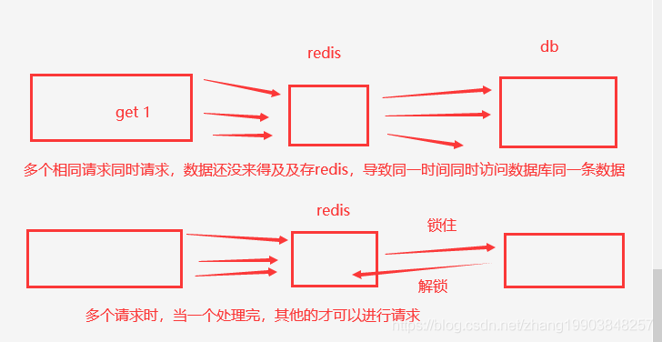

### SpringCache整合redis使用总结

### docker安装redis 
    下载Redis
        docker pull reids

    启动Redis
        docker run -d --name redis -p 6379:6379 redis:latest

    连接Redis
        docker exec -ti 95b40 redis-cli

    启动容器
        docker start CONTAINER_ID / CONTAINER_NAME

    重启容器
         docker restart CONTAINER_ID / CONTAINER_NAME

    停止容器
    方式一
    docker stop NAMES
    方式二
    docker stop CONTAINER ID

### SpringBoot项目工程，选择maven把SpringCache和redis依赖进来
 
    <properties>
           <spring.redis.version>2.6.4</spring.redis.version>
    </properties>

    <dependencies>
        <dependency>
               <groupId>org.springframework.boot</groupId>
               <artifactId>spring-boot-starter-data-redis</artifactId>
               <version>${spring.redis.version}</version>
        </dependency>
        <dependency>
               <groupId>org.springframework.boot</groupId>
               <artifactId>spring-boot-starter-cache</artifactId>
        </dependency>
         <dependency>
                    <groupId>com.fasterxml.jackson.datatype</groupId>
                    <artifactId>jackson-datatype-jsr310</artifactId>
                    <version>${jackson.datatype.version}</version>
        </dependency>
    </dependencies>
 


### application.yml 配置信息

```yaml
spring:
  redis:
    database: 0
    host: 10.207.0.169
     # host: 127.0.0.1
    port: 6379
    password:
    #超时时间
    timeout: 1000
    lettuce:
      pool:
        max-wait: -1ms # 最大连接阻塞等待时间，默认值-1
        max-idle: 8 # 最大空闲连接数，默认值为8
        min-idle: 2 # 最小空闲连接数
        max-active: 20 #最大连接数
  cache:
     type: redis #缓存类型
     redis:
        cache-null-values: false #不缓存null数据
        time-to-live: 50000ms #超时时间
        use-key-prefix: false #不适用前缀
```
### 注意Jedis和Lettuce链接redis区别
       1、Jedis有多线程安全问题，并且它的性能也堪忧，大有被淘汰的趋势。但是它还仍旧还是当下的主流的Java访问Redis的客户端
       2、Lettuce作为新时代的Redis客户端，它势必成为将来的主流（其实现在也很主流了，比如SpringBoot2.0后默认就使用它作为Redis的Client访问）。
### 创建RedisConfig配置类并且在类型上加入@EnableCaching开启缓存
    
```java

import com.fasterxml.jackson.annotation.JsonAutoDetect;
import com.fasterxml.jackson.annotation.PropertyAccessor;
import com.fasterxml.jackson.databind.ObjectMapper;
import com.fasterxml.jackson.datatype.jsr310.JavaTimeModule;
import com.fasterxml.jackson.datatype.jsr310.deser.LocalDateDeserializer;
import com.fasterxml.jackson.datatype.jsr310.deser.LocalDateTimeDeserializer;
import com.fasterxml.jackson.datatype.jsr310.deser.LocalTimeDeserializer;
import com.fasterxml.jackson.datatype.jsr310.ser.LocalDateSerializer;
import com.fasterxml.jackson.datatype.jsr310.ser.LocalDateTimeSerializer;
import com.fasterxml.jackson.datatype.jsr310.ser.LocalTimeSerializer;
import com.formssi.mall.redis.service.RedisService;
import org.springframework.cache.annotation.EnableCaching;
import org.springframework.context.annotation.Bean;
import org.springframework.context.annotation.Configuration;
import org.springframework.data.redis.cache.RedisCacheConfiguration;
import org.springframework.data.redis.cache.RedisCacheManager;
import org.springframework.data.redis.connection.RedisConnectionFactory;
import org.springframework.data.redis.core.RedisTemplate;
import org.springframework.data.redis.serializer.Jackson2JsonRedisSerializer;
import org.springframework.data.redis.serializer.RedisSerializationContext;
import org.springframework.data.redis.serializer.RedisSerializer;
import org.springframework.data.redis.serializer.StringRedisSerializer;

import java.time.Duration;
import java.time.LocalDate;
import java.time.LocalDateTime;
import java.time.LocalTime;
import java.time.format.DateTimeFormatter;
import java.util.HashMap;
import java.util.Map;


@Configuration
@EnableCaching //开启缓存
public class RedisConfig {
    /**
     * 过期时间7天
     */
    private final Duration timeToLive = Duration.ofDays(7);

    private final StringRedisSerializer keySerializer = new StringRedisSerializer();


    //使用Jackson2JsonRedisSerializer来序列化和反序列化redis的value值（默认使用JDK的序列化方式）
    private Jackson2JsonRedisSerializer valueSerializer = new Jackson2JsonRedisSerializer(Object.class);

    /**
     * 缓存管理器
     *
     * @param redisConnectionFactory
     * @return
     */
    @Bean
    public RedisCacheManager cacheManager(RedisConnectionFactory redisConnectionFactory) {

        // 生成一个默认配置，通过config对象即可对缓存进行自定义配置
        RedisCacheConfiguration config = RedisCacheConfiguration.defaultCacheConfig();
        // 设置缓存的默认过期时间，也是使用Duration设置
        config = config.entryTtl(timeToLive)
                // 设置 key为string序列化
                .serializeKeysWith(RedisSerializationContext.SerializationPair.fromSerializer(new StringRedisSerializer()))
                // 设置value为json序列化
                .serializeValuesWith(RedisSerializationContext.SerializationPair.fromSerializer(jackson2JsonRedisSerializer()))
                // 不缓存空值
                .disableCachingNullValues();

        // 对每个缓存空间应用不同的配置
        Map<String, RedisCacheConfiguration> configMap = new HashMap<>();
        configMap.put("MallCache", config.entryTtl(Duration.ofMinutes(30)));

        // 使用自定义的缓存配置初始化一个cacheManager
        RedisCacheManager cacheManager = RedisCacheManager.builder(redisConnectionFactory)
                //默认配置
                .cacheDefaults(config)
                // 特殊配置（一定要先调用该方法设置初始化的缓存名，再初始化相关的配置）
                .initialCacheNames(configMap.keySet())
                .withInitialCacheConfigurations(configMap)
                .build();
        return cacheManager;
    }

    @Bean
    public RedisTemplate<String, Object> redisTemplate(RedisConnectionFactory factory) {

        RedisTemplate<String, Object> redisTemplate = new RedisTemplate<>();

        ObjectMapper om = new ObjectMapper();
        om.setVisibility(PropertyAccessor.ALL, JsonAutoDetect.Visibility.ANY);
        om.enableDefaultTyping(ObjectMapper.DefaultTyping.NON_FINAL);
        // 日期和时间格式化
        JavaTimeModule javaTimeModule = new JavaTimeModule();
        // 设置LocalDateTime的序列化格式
        javaTimeModule.addSerializer(LocalDateTime.class, new LocalDateTimeSerializer(DateTimeFormatter.ofPattern("yyyy-MM-dd HH:mm:ss")));
        javaTimeModule.addSerializer(LocalDate.class, new LocalDateSerializer(DateTimeFormatter.ofPattern("yyyy-MM-dd")));
        javaTimeModule.addSerializer(LocalTime.class, new LocalTimeSerializer(DateTimeFormatter.ofPattern("HH:mm:ss")));
        javaTimeModule.addDeserializer(LocalDateTime.class, new LocalDateTimeDeserializer(DateTimeFormatter.ofPattern("yyyy-MM-dd HH:mm:ss")));
        javaTimeModule.addDeserializer(LocalDate.class, new LocalDateDeserializer(DateTimeFormatter.ofPattern("yyyy-MM-dd")));
        javaTimeModule.addDeserializer(LocalTime.class, new LocalTimeDeserializer(DateTimeFormatter.ofPattern("HH:mm:ss")));
        om.registerModule(javaTimeModule);

        valueSerializer.setObjectMapper(om);

        redisTemplate.setConnectionFactory(factory);
        //key序列化
        redisTemplate.setKeySerializer(keySerializer);
        //value序列化
        redisTemplate.setValueSerializer(jackson2JsonRedisSerializer());
        //value hashmap序列化
        redisTemplate.setHashKeySerializer(keySerializer);
        //key hashmap序列化
        redisTemplate.setHashValueSerializer(jackson2JsonRedisSerializer());
        return redisTemplate;
    }

    /**
     * json序列化
     *
     * @return
     */
    private RedisSerializer<Object> jackson2JsonRedisSerializer() {
        //使用Jackson2JsonRedisSerializer来序列化和反序列化redis的value值
        Jackson2JsonRedisSerializer<Object> serializer = new Jackson2JsonRedisSerializer<>(Object.class);
        //json转对象类，不设置默认的会将json转成hashmap
        ObjectMapper mapper = new ObjectMapper();
        mapper.setVisibility(PropertyAccessor.ALL, JsonAutoDetect.Visibility.ANY);
        mapper.enableDefaultTyping(ObjectMapper.DefaultTyping.NON_FINAL);
        serializer.setObjectMapper(mapper);
        return serializer;
    }

    @Bean
    public RedisService redisService() {
        return new RedisService();
    }
}

```

### 创建实体类

```java
import com.baomidou.mybatisplus.annotation.IdType;
 
import lombok.*;

import java.io.Serializable;


@Data
@AllArgsConstructor
@EqualsAndHashCode(callSuper = false)
@NoArgsConstructor
@TableName("dept")
public class DeptDO implements Serializable {
    private static final long serialVersionUID = 1L;

    @TableId(value = "id", type = IdType.AUTO)
    private Long id;
    
    private String deptName;
    
    private String deptCode;
   
    private Long parentId;


}
 
```    
###spring基于注解的缓存

    对于缓存声明，spring的缓存提供了一组java注解:

    @Cacheable:触发缓存写入。
    @CacheEvict:触发缓存清除。
    @CachePut:更新缓存(不会影响到方法的运行)。
    @Caching:重新组合要应用于方法的多个缓存操作。
    @CacheConfig:设置类级别上共享的一些常见缓存设置。 

    1、@Cacheable注解
        参数如下
        String[] value() default {}; //缓存名字
        String[] cacheNames() default {}; //缓存名字
        String key() default “”; //缓存的key
        String keyGenerator() default “”; //传承key生产器
        String cacheManager() default “”; //缓存管理器
        String cacheResolver() default “”; //缓存解析器
        String condition() default “”; //条件判断，(SpEl表达式)true 则走缓存 false 则不走缓存
        String unless() default “”; //否定缓存，当满足条件时，结果不被缓存。可以获取到结果（#result）进行判断。支持spEL语法
        boolean sync() default false;//在多线程环境中，可能会为同一参数同时调用某些操作，可以使用sync属性来指示基础缓存提供程序在计算值时锁定缓存条目。结果，只有一个线程正在忙于计算该值，而其他线程则被阻塞，直到在缓存中更新该条目为止。

        顾名思义，@Cacheable可以用来进行缓存的写入，将结果存储在缓存中，以便于在后续调用的时候可以直接返回缓存中的值，而不必再执行实际的方法。 最简单的使用方式,注解名称=缓存名称,使用例子如下:
        @Cacheable(value/cacheNames)
        不能为null, 缓存名称，二者选任意一个即可。 

        @Cacheable(cacheNames="deptCache", key = "#deptDO.id")
        public DeptDO getDeptById(DeptDO deptDO) {
        return new DeptDO(deptDO.getId(), "get部门名称：" + deptDO.getDeptName(), "部门编码：" + deptDO.getDeptCode(), deptDO.getParentId());
        }
        或者是
        @CachePut(value = "deptCache", key = "'dept:' + #deptDO.id")
        public DeptDO getDeptById(DeptDO deptDO) {
            return new DeptDO(deptDO.getId(), "get部门名称：" + deptDO.getDeptName(), "部门编码：" + deptDO.getDeptCode(), deptDO.getParentId());
        }
        或者是
        @Cacheable(cacheNames="deptCache", key = "'dept:' + #deptDO.id")
        public DeptDO getDeptById(DeptDO deptDO) {
            return new DeptDO(deptDO.getId(), "get部门名称：" + deptDO.getDeptName(), "部门编码：" + deptDO.getDeptCode(), deptDO.getParentId());
        }

        ##注意带'#' 是对应    #deptDO.id = deptDO.getId()
        
    
    2、@Cacheable还可以设置根据条件判断是否需要缓存
        condition:取决于给定的参数是否满足条件,默认为true 缓存
         
            @Cacheable(cacheNames="deptCache", key = "'dept:' + #deptDO.id", condition = "#deptDO.id>8") //限定入参id必须大于8 
            public DeptDO addDept(DeptDO deptDO) {
            System.out.println("添加成功deptId:" + deptDO.toString());
            if(deptDO.getId()!=null)
            {
                return new DeptDO(deptDO.getId(), "add部门名称：" + deptDO.getDeptName(), "部门编码：" + deptDO.getDeptCode(), deptDO.getParentId());
            }
            return null;
            }
        
        unless:取决于返回值是否满足条件不被缓存的条件，默认为false。即能执行的都被缓存
          
            @Cacheable(cacheNames="deptCache", key = "'dept:' + #deptDO.id", unless = "#deptDO.id>8") //限定入参idid大于8的将不被缓存
            public DeptDO addDept(DeptDO deptDO) {
            System.out.println("添加成功deptId:" + deptDO.toString());
            if(deptDO.getId()!=null)
            {
            return new DeptDO(deptDO.getId(), "add部门名称：" + deptDO.getDeptName(), "部门编码：" + deptDO.getDeptCode(), deptDO.getParentId());
            }
            return null;
            }
        condition和unless区别
            condition默认为true，unless默认为false。
            condition为false时，unless为true。不被缓存
            condition为false，unless为false。不被缓存
            condition为true，unless为true。 不被缓存
            conditon为true，unless为false。缓存 
        sync  该方法这能在@Cacheable上用
            是否同步，true/false。在一个多线程的环境中，某些操作可能被相同的参数并发地调用，这样同一个 value 值可能被多次计算（或多次访问 db），这样就达不到缓存的目的。针对这些可能高并发的操作，我们可以使用 sync 参数来告诉底层的缓存提供者将缓存的入口锁住，
            这样就只能有一个线程计算操作的结果值，而其它线程需要等待，这样就避免了 n-1 次数据库访问。 sync = true 可以有效的避免缓存击穿的问题。

            
    3、@CachePut和Cacheablle有相同的属性（没有 sync 属性），通常用于更新操作。
        @Cacheable 的逻辑是：查找缓存 - 有就返回 -没有就执行方法体 - 将结果缓存起来；
        @CachePut 的逻辑是：执行方法体 - 将结果缓存起来；
        注意：@Cacheable 和 @CachePut 注解到同一个方法。 
        
               @CachePut(cacheNames="deptCache", key = "'dept:' + #deptDO.id", condition = "#deptDO.id>8")
                public DeptDO addDept(DeptDO deptDO) {
                    System.out.println("添加成功deptId:" + deptDO.toString());
                    if(deptDO.getId()!=null)
                    {
                        return new DeptDO(deptDO.getId(), "add部门名称：" + deptDO.getDeptName(), "部门编码：" + deptDO.getDeptCode(), deptDO.getParentId());
                    }
                    return null;
                }
    4、@CacheEvit
        删除缓存，每次调用它注解的方法，就会执行删除指定的缓存
        跟 @Cacheable 和 @CachePut 一样，@CacheEvict 也要求指定一个或多个缓存，也指定自定义一的缓存解析器和 key 生成器，也支持指定条件（condition 参数）
        
        CacheEvit，有两个特有的属性：allEntries和beforeInvocation
        allEntries：
             默认为false，为true时，表示清空该cachename下的所有缓存
        beforeInvocation：
             默认为false，为true时，先删除缓存，再删除数据库。 
    
                @CacheEvict(cacheNames="deptCache", key = "'dept:' + #deptDO.id", beforeInvocation =true ,allEntries = true)
                public boolean deleteDeptById(DeptDO deptDO) {
                System.out.println("删除成功" + deptDO.getId());
                return true;
                }

### 简单的Service 实现
```java


import com.mongodbspring.bean.DeptDO;
import org.springframework.cache.annotation.CacheEvict;
import org.springframework.cache.annotation.CachePut;
import org.springframework.cache.annotation.Cacheable;
import org.springframework.stereotype.Service;

@Service
public class DeptService {

    @Cacheable(cacheNames="deptCache", key = "'dept:' + #deptDO.id" )
    public DeptDO getDeptById(DeptDO deptDO) {
        System.out.println("获取到deptId:" + deptDO.getDeptName());
        return new DeptDO(deptDO.getId(), "get部门名称：" + deptDO.getDeptName(), "部门编码：" + deptDO.getDeptCode(), deptDO.getParentId());
    }
    @CachePut(cacheNames="deptCache", key = "'dept:' + #deptDO.id", condition = "#deptDO.id>8")  //condition 限定id入参必须大于8
    public DeptDO addDept(DeptDO deptDO) {
        System.out.println("添加成功deptId:" + deptDO.toString());
        if(deptDO.getId()!=null)
        {
            return new DeptDO(deptDO.getId(), "add部门名称：" + deptDO.getDeptName(), "部门编码：" + deptDO.getDeptCode(), deptDO.getParentId());
        }
        return null;
    }

    @CacheEvict(cacheNames="deptCache", key = "'dept:' + #deptDO.id")
    public boolean deleteDeptById(DeptDO deptDO) {
        System.out.println("删除成功" + deptDO.getId());
        return true;
    }

    @Cacheable(value = "common", key = "'common:dept:' + #deptDO.id")
    public DeptDO getCommonDept(DeptDO deptDO) {
        System.out.println("执行此方法，说明没有缓存（测试公共配置是否生效）");
        return new DeptDO(deptDO.getId(), "用户名(common)_" + deptDO.getDeptName(), "部门编码：" + deptDO.getDeptCode(), deptDO.getParentId());
    }

}
```

###Controller
```java
import com.mongodbspring.bean.DeptDO;
import com.mongodbspring.service.DeptService;
import org.springframework.web.bind.annotation.PostMapping;
import org.springframework.web.bind.annotation.RequestBody;
import org.springframework.web.bind.annotation.RequestMapping;
import org.springframework.web.bind.annotation.RestController;

import javax.annotation.Resource;

@RestController
@RequestMapping("/dept")
public class DeptController {
    @Resource
    private DeptService deptService;

    @PostMapping("/getDept")
    public DeptDO getDept(@RequestBody DeptDO deptDO) {
        return deptService.getDeptById(deptDO);
    }

    @PostMapping("/addDept")
    public DeptDO addDept(@RequestBody DeptDO deptDO) {
        return deptService.addDept(deptDO);
    }

    @PostMapping("/deleteDept")
    public Boolean deleteById(@RequestBody DeptDO deptDO) {
        return deptService.deleteDeptById(deptDO);
    }

    @PostMapping("/getCommonDept")
    public DeptDO getCommonDept(@RequestBody DeptDO deptDO) {
        return deptService.getCommonDept(deptDO);
    }
}
```