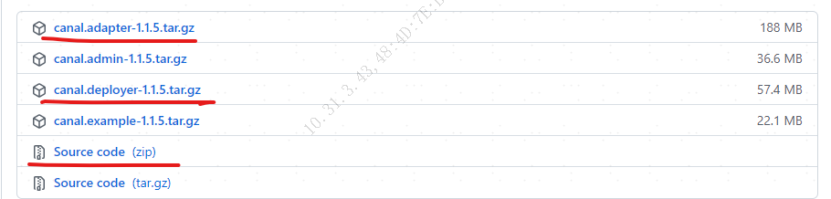
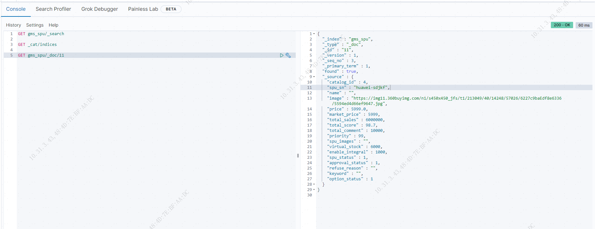

= 优化商品分类树形接口,研究商品搜索
foncen
:doctype: book
:idprefix: canal
:idseparator: -
:toc: left
:toclevels: 5
:toc-title: 优化商品分类树形接口,研究商品搜索
:icons: font
:project-full-name: canal 实时同步数据到es
:favicon: ../images/canal/favicon.png

---
== 1. 优化商品树形接口

TIP: 原因:

****
由于之前的实现存在数据连接占用问题,效果不好,需要优化为一次查询所有子类.
****

=== 1.1 解决方案
****
通过 mybatis 结果映射中的 collection 集合标签递归查询,实现一次查出所有满足条件的分类数据,具体实现如下
****
.接口方法
[%collapsible]
====
.GmsCategoryMapper
[source,java]
----
/**
 * 商品分类mapper接口
 */
public interface GmsCategoryMapper extends BaseMapper<GmsCategoryDo> {

    /**
     * 查询分类树
     *
     * @param qry
     * @return
     */
    List<GmsCategoryPo> listCate(GmsCategoryPageQry qry);

}
----
====

.mapper配置
[%collapsible]
====
.GmsCategoryMapper.xml
[source,xml]
----
<resultMap id="listCateMap" type="com.formssi.mall.goods.domain.repository.po.GmsCategoryPo">
        <id column="id" property="id"/>
        <result column="name" property="name"/>
        <result column="parent_id" property="parentId"/>
        <result column="image" property="image"/>
        <result column="level" property="level"/>
        <result column="priority" property="priority"/>
        <result column="option_status" property="optionStatus" />
        <collection property="zList" select="getCateByParentId" column="id"/>
    </resultMap>
    <!--根据条件查询类别-->
    <select id="listCate" resultMap="listCateMap">
        SELECT id,name,parent_id,image,level,priority,option_status FROM gms_category
        <where>
            option_status = 1
            <if test="id != null">
                and id = #{id}
            </if>
            <if test="parentId != null">
                and parent_id = #{parentId}
            </if>
            <if test="level != null">
                and level = #{level}
            </if>
            ORDER BY priority DESC
        </where>
    </select>
    <!--通过parentId 查询所有子类-->
    <select id="getCateByParentId" resultMap="listCateMap">
        SELECT id,name,parent_id,image,level,priority,option_status FROM gms_category
        <where>
            option_status = 1
            <if test="id != null">
                and parent_id = #{id}
            </if>
        </where>
        ORDER BY priority DESC
    </select>
----
====
=== 1.2 测试结果
.请求参数
[%collapsible]
====
.10.31.3.43:18084/gms/cate
[source,json]
----
{
    "level":0
}
----
====
.响应结果
[%collapsible]
====
[source,json]
----
{
    "code": "200",
    "message": "请求成功",
    "body": [
        {
            "id": 1,
            "name": "手机",
            "parentId": 0,
            "image": null,
            "level": 0,
            "priority": 9,
            "optionStatus": 1,
            "zlist": [
                {
                    "id": 4,
                    "name": "智能手机",
                    "parentId": 1,
                    "image": null,
                    "level": 1,
                    "priority": 9,
                    "optionStatus": 1,
                    "zlist": [
                        {
                            "id": 7,
                            "name": "商务智能手机",
                            "parentId": 4,
                            "image": null,
                            "level": 2,
                            "priority": 9,
                            "optionStatus": 1,
                            "zlist": []
                        }
                    ]
                },
                {
                    "id": 5,
                    "name": "老人机",
                    "parentId": 1,
                    "image": null,
                    "level": 1,
                    "priority": 8,
                    "optionStatus": 1,
                    "zlist": []
                },
                {
                    "id": 6,
                    "name": "对讲机",
                    "parentId": 1,
                    "image": null,
                    "level": 1,
                    "priority": 7,
                    "optionStatus": 1,
                    "zlist": []
                }
            ]
        },
        {
            "id": 2,
            "name": "蔬菜",
            "parentId": 0,
            "image": null,
            "level": 0,
            "priority": 8,
            "optionStatus": 1,
            "zlist": []
        },
        {
            "id": 3,
            "name": "水果",
            "parentId": 0,
            "image": null,
            "level": 0,
            "priority": 7,
            "optionStatus": 1,
            "zlist": []
        }
    ],
    "ok": true
}
----
====

== 2. 研究商品搜索
TIP: 需求 :
****
研究一个方案把商品信息同步到 ElasticSearch
****
=== 2.1 方案选择
****
通过查找之后,可执行 mysql 数据到 es 的插件有:

* elasticsearch-jdbc
* elasticsearch-river-Mysql
* go-mysql-elasticsearch
* logstash-input-jdbc
* canal
* DTS (闭源)
* CloudCanal  (闭源)
* maxwell(直接将binlog解析成json存储在kafka中)
* debezium (debezium同时支持源端MySQL和Postgres、MongoDB,需要kafka支持)
* DataBus (Linkedin开源作品)
* DataX (与 DataBus 类似,但是抓取数据方式为定时抓取)
****
==== 2.1.1 插件优缺点对比
.tables1{counter:index:0}
|===
|序号|插件名称|优点|不足

|{counter:index}
|elasticsearch-jdbc
|  1.相对通用, 2.版本更新角度,GitHub活跃度很高
| 不能实现同步删除操作,mysql删除了,es中仍然存在

|{counter:index}
|elasticsearch-river-Mysql
|未了解
| 2012年之后没有继续更新了

|{counter:index}
|go-mysql-elasticsearch
|能实现同步增,删,改,查操作
|GitHub活跃度不高,最近一次更新两年前

|{counter:index}
|logstash-input-jdbc
|能实现同步增,改操作,版本更新迭代快,相对稳定,作为es固有插件logstash一部分,易用.
|不能同步实现删除操作,mysql删除了,es中值仍然存在,需要定时扫描数据库,数据存在延迟

|{counter:index}
|canal
|基于数据库增量日志解析，提供增量数据订阅 & 消费,可配置高可用集群
|1.不能同步实现删除操作,二进制日志格式必须为 row 模式,2.同步的表必须要有主键,3.支持部分ddl同步，ddl语句不支持幂等性操作,4.不支持带外键的记录同步
|===
=== 2.2 canal 介绍
****
Canal是阿里巴巴开源的数据库Binlog日志解析框架，主要用途是基于 MySQL 数据库增量日志解析，提供增量数据订阅和消费。
****
==== 2.2.1 canal 简介
NOTE: 简介

image::../images/canal/canal-frame.png[简介]
****
canal [kə'næl]，译意为水道/管道/沟渠，主要用途是基于 MySQL 数据库增量日志解析，提供增量数据订阅和消费

早期阿里巴巴因为杭州和美国双机房部署，存在跨机房同步的业务需求，实现方式主要是基于业务 trigger 获取增量变更。从 2010 年开始，业务逐步尝试数据库日志解析获取增量变更进行同步，由此衍生出了大量的数据库增量订阅和消费业务。

基于日志增量订阅和消费的业务包括

* 数据库镜像
* 数据库实时备份
* 索引构建和实时维护(拆分异构索引、倒排索引等)
* 业务 cache 刷新
* 带业务逻辑的增量数据处理
* 当前的 canal 支持源端 MySQL 版本包括 5.1.x , 5.5.x , 5.6.x , 5.7.x , 8.0.x
****
==== 2.2.2 工作原理
NOTE: mysql 主从复制原理

image::../images/canal/mysql_m_s.png[mysql 主从复制]
****
* MySQL master 将数据变更写入二进制日志( binary log, 其中记录叫做二进制日志事件binary log events，可以通过 show binlog events 进行查看)
* MySQL slave 将 master 的 binary log events 拷贝到它的中继日志(relay log)
* MySQL slave 重放 relay log 中事件，将数据变更反映它自己的数据
****
NOTE: canal 工作原理

image::../images/canal/canal_work.png[canal工作原理]
****
* canal 模拟 MySQL slave 的交互协议，伪装自己为 MySQL slave ，向 MySQL master 发送dump 协议
* MySQL master 收到 dump 请求，开始推送 binary log 给 slave (即 canal )
* canal 解析 binary log 对象(原始为 byte 流)
****
=== 2.3 单机部署 canal-1.1.5
****
初次尝试,选择本地单机部署 canal,后续可以打包成镜像通过 docker 部署
****
==== 2.3.1 环境准备
****
* 服务器ip :10.207.0.169
* ssh用户/密码 : root/formssi!!
****
==== 2.3.2 基于已有 docker 容器
TIP: 在efk服务器的基础上尝试部署

.服务器已有容器
[%collapsible]
====
.mysql-test,elasticsearch,kibana
[source,shell]
----
[root@localhost ~]# docker ps
CONTAINER ID        IMAGE                                    COMMAND                  CREATED             STATUS              PORTS                                            NAMES
d24348476ce1        docker.elastic.co/beats/filebeat:7.7.1   "/usr/local/bin/do..."   8 days ago          Up 6 days                                                            filebeat
9b48a2161558        elastic/kibana:7.7.1                     "/usr/local/bin/du..."   8 days ago          Up 8 days           0.0.0.0:5601->5601/tcp                           kibana
f070ba380dd9        elasticsearch:7.7.1                      "/tini -- /usr/loc..."   8 days ago          Up 8 days           0.0.0.0:9200->9200/tcp, 0.0.0.0:9300->9300/tcp   elasticsearch
404ee9e20e9d        nginx                                    "/docker-entrypoin..."   3 weeks ago         Up 3 weeks          0.0.0.0:8080->80/tcp                             nginx-test
ea7d0ccb18cf        mysql                                    "docker-entrypoint..."   3 weeks ago         Up 3 weeks          0.0.0.0:3306->3306/tcp, 33060/tcp                mysql-test
5f0c38c5ca20        mongo                                    "docker-entrypoint..."   3 weeks ago         Up 3 weeks          0.0.0.0:27017->27017/tcp                         mongodb
15098c48f946        redis                                    "docker-entrypoint..."   3 weeks ago         Up 3 weeks          0.0.0.0:6379->6379/tcp                           redis
----
====
==== 2.3.3 mysql 准备
NOTE: mysql 日志开启 , row模式

.mysql配置
[%collapsible]
====
.binlog,formate,master status
[source,shell]
----
mysql> show master status;
+---------------+----------+--------------+------------------+-------------------+
| File          | Position | Binlog_Do_DB | Binlog_Ignore_DB | Executed_Gtid_Set |
+---------------+----------+--------------+------------------+-------------------+
| binlog.000002 |    64287 |              |                  |                   |
+---------------+----------+--------------+------------------+-------------------+
1 row in set (0.00 sec)

mysql> show variables like 'log_bin';
+---------------+-------+
| Variable_name | Value |
+---------------+-------+
| log_bin       | ON    |
+---------------+-------+
1 row in set (0.01 sec)

mysql> show variables like 'binlog_format';
+---------------+-------+
| Variable_name | Value |
+---------------+-------+
| binlog_format | ROW   |
+---------------+-------+
1 row in set (0.01 sec)
----
====
NOTE: slave 用户创建
****
授权 canal 链接 MySQL 账号具有作为 MySQL slave 的权限, 如果已有账户可直接 grant
****
.创建用户并授权
[source,shell]
====
.创建用户
----
CREATE USER canal IDENTIFIED BY 'canal';
----
.赋权
----
GRANT SELECT, REPLICATION SLAVE, REPLICATION CLIENT ON *.* TO 'canal'@'%';
-- GRANT ALL PRIVILEGES ON *.* TO 'canal'@'%' ;
----
.刷新使立即生效
----
FLUSH PRIVILEGES;
----
====

==== 2.3.4 es + kibana
NOTE: es + kibana 环境验证

.es rest接口可用
[%collapsible]
====
.http://10.207.0.169:9200/
[source,json]
----
{
  "name" : "f070ba380dd9",
  "cluster_name" : "elasticsearch",
  "cluster_uuid" : "zcqSJ8VfQ06tknhtzE_qYw",
  "version" : {
    "number" : "7.7.1",
    "build_flavor" : "default",
    "build_type" : "docker",
    "build_hash" : "ad56dce891c901a492bb1ee393f12dfff473a423",
    "build_date" : "2020-05-28T16:30:01.040088Z",
    "build_snapshot" : false,
    "lucene_version" : "8.5.1",
    "minimum_wire_compatibility_version" : "6.8.0",
    "minimum_index_compatibility_version" : "6.0.0-beta1"
  },
  "tagline" : "You Know, for Search"
}
----
====

.kiban 检查 http://10.207.0.169:5601/app/kibana#/dev_tools/console
[%collapsible]
====
image::../images/canal/kibana_console.png[kibana]
====
==== 2.3.4 创建索引映射
TIP: 通过post提交可以自动创建索引映射,可以用这个模板修改映射再重新创建索引

.gms_spu es 索引结构
[%collapsible]
====
[source,json]
----
{
  "gms_spu" : {
    "aliases" : { },
    "mappings" : {
      "properties" : {
        "approvalStatus" : {
          "type" : "long"
        },
        "approval_status" : {
          "type" : "long"
        },
        "catalogId" : {
          "type" : "long"
        },
        "catalog_id" : {
          "type" : "long"
        },
        "createTime" : {
          "type" : "date"
        },
        "enableIntegral" : {
          "type" : "long"
        },
        "enable_integral" : {
          "type" : "long"
        },
        "image" : {
          "type" : "text",
          "fields" : {
            "keyword" : {
              "type" : "keyword",
              "ignore_above" : 256
            }
          }
        },
        "introduce" : {
          "type" : "text",
          "fields" : {
            "keyword" : {
              "type" : "keyword",
              "ignore_above" : 256
            }
          }
        },
        "keyword" : {
          "type" : "text",
          "fields" : {
            "keyword" : {
              "type" : "keyword",
              "ignore_above" : 256
            }
          }
        },
        "marketPrice" : {
          "type" : "float"
        },
        "market_price" : {
          "type" : "long"
        },
        "name" : {
          "type" : "text",
          "fields" : {
            "keyword" : {
              "type" : "keyword",
              "ignore_above" : 256
            }
          }
        },
        "optionStatus" : {
          "type" : "long"
        },
        "option_status" : {
          "type" : "long"
        },
        "price" : {
          "type" : "float"
        },
        "priority" : {
          "type" : "long"
        },
        "refuseReason" : {
          "type" : "text",
          "fields" : {
            "keyword" : {
              "type" : "keyword",
              "ignore_above" : 256
            }
          }
        },
        "refuse_reason" : {
          "type" : "text",
          "fields" : {
            "keyword" : {
              "type" : "keyword",
              "ignore_above" : 256
            }
          }
        },
        "spuSn" : {
          "type" : "text",
          "fields" : {
            "keyword" : {
              "type" : "keyword",
              "ignore_above" : 256
            }
          }
        },
        "spuStatus" : {
          "type" : "long"
        },
        "spu_images" : {
          "type" : "text",
          "fields" : {
            "keyword" : {
              "type" : "keyword",
              "ignore_above" : 256
            }
          }
        },
        "spu_sn" : {
          "type" : "text",
          "fields" : {
            "keyword" : {
              "type" : "keyword",
              "ignore_above" : 256
            }
          }
        },
        "spu_status" : {
          "type" : "long"
        },
        "sub_title" : {
          "type" : "text",
          "fields" : {
            "keyword" : {
              "type" : "keyword",
              "ignore_above" : 256
            }
          }
        },
        "totalComment" : {
          "type" : "long"
        },
        "totalSales" : {
          "type" : "long"
        },
        "totalScore" : {
          "type" : "float"
        },
        "total_comment" : {
          "type" : "long"
        },
        "total_sales" : {
          "type" : "long"
        },
        "total_score" : {
          "type" : "float"
        },
        "updateTime" : {
          "type" : "date"
        },
        "virtualStock" : {
          "type" : "long"
        },
        "virtual_stock" : {
          "type" : "long"
        }
      }
    },
    "settings" : {
      "index" : {
        "creation_date" : "1651128188641",
        "number_of_shards" : "1",
        "number_of_replicas" : "1",
        "uuid" : "-oqf1aqRRdGL4NHaGeuSvA",
        "version" : {
          "created" : "7070199"
        },
        "provided_name" : "gms_spu"
      }
    }
  }
}

----
====

=== 2.4 canal-1.1.5 部署
.Asserts
[%collapsible]
====

====

.解压缩如下
====
[source,shell]
----
[root@localhost canal]# ll
总用量 288992
drwxr-xr-x. 7 root root       100 4月  26 11:46 canal-adapter
-rw-r--r--. 1 root root 197350026 4月  26 09:57 canal.adapter-1.1.5.tar.gz
drwxr-xr-x. 6 root root        52 4月  26 10:03 canal-admin
-rw-r--r--. 1 root root  38366781 4月  26 09:56 canal.admin-1.1.5.tar.gz
drwxr-xr-x. 7 root root       101 4月  26 10:39 canal-deployer
-rw-r--r--. 1 root root  60205298 4月  26 09:59 canal.deployer-1.1.5.tar.gz
----
====
.源码
====
image::../images/canal/canal_source.png[源码]
====
==== 2.4.1 canal-deployer 配置
.修改配置
====
----
vi conf/example/instance.properties
----
====
.instance.properties
[%collapsible]
====
[source,yaml]
----
#################################################
## mysql serverId , v1.0.26+ will autoGen
 canal.instance.mysql.slaveId=123  # slaveserver id 服务器唯一id

# enable gtid use true/false
canal.instance.gtidon=false

# position info
canal.instance.master.address=localhost:3306  # mysql主服务器位置
canal.instance.master.journal.name=
canal.instance.master.position=
canal.instance.master.timestamp=
canal.instance.master.gtid=

# rds oss binlog
canal.instance.rds.accesskey=
canal.instance.rds.secretkey=
canal.instance.rds.instanceId=

# table meta tsdb info
canal.instance.tsdb.enable=false
#canal.instance.tsdb.url=jdbc:mysql://127.0.0.1:3306
#canal.instance.tsdb.dbUsername=canal
#canal.instance.tsdb.dbPassword=canal

#canal.instance.standby.address =
#canal.instance.standby.journal.name =
#canal.instance.standby.position =
#canal.instance.standby.timestamp =
#canal.instance.standby.gtid=

# username/password
canal.instance.dbUsername=canal  # slave 用户名
canal.instance.dbPassword=canal  # slave 密码
canal.instance.defaultDatabaseName=canal_test #默认同步数据库
canal.instance.connectionCharset = UTF-8
# enable druid Decrypt database password
canal.instance.enableDruid=false
#canal.instance.pwdPublicKey=MFwwDQYJKoZIhvcNAQEBBQADSwAwSAJBALK4BUxdDltRRE5/zXpVEVPUgunvscYFtEip3pmLlhrWpacX7y7GCMo2/JM6LeHmiiNdH1FWgGCpUfircSwlWKUCAwEAAQ==

# table regex
canal.instance.filter.regex=.*\\..*  #同步所有表
# table black regex
canal.instance.filter.black.regex=mysql\\.slave_.*
# table field filter(format: schema1.tableName1:field1/field2,schema2.tableName2:field1/field2)
#canal.instance.filter.field=test1.t_product:id/subject/keywords,test2.t_company:id/name/contact/ch
# table field black filter(format: schema1.tableName1:field1/field2,schema2.tableName2:field1/field2)
#canal.instance.filter.black.field=test1.t_product:subject/product_image,test2.t_company:id/name/contact/ch

# mq config
canal.mq.topic=example
# dynamic topic route by schema or table regex
#canal.mq.dynamicTopic=mytest1.user,mytest2\\..*,.*\\..*
canal.mq.partition=0
# hash partition config
#canal.mq.partitionsNum=3
#canal.mq.partitionHash=test.table:id^name,.*\\..*
#canal.mq.dynamicTopicPartitionNum=test.*:4,mycanal:6
#################################################

----
* canal.instance.connectionCharset 代表数据库的编码方式对应到 java 中的编码类型，比如 UTF-8，GBK , ISO-8859-1
* 如果系统是1个 cpu，需要将 canal.instance.parser.parallel 设置为 false
====
==== 2.4.2 canal-deployer 启动
.启动
----
sh bin/startup.sh
----
.启动详情
[%collapsible]
====
----
[root@localhost canal-deployer]# sh bin/startup.sh
cd to /root/docker/canal/canal-deployer/bin for workaround relative path
LOG CONFIGURATION : /root/docker/canal/canal-deployer/bin/../conf/logback.xml
canal conf : /root/docker/canal/canal-deployer/bin/../conf/canal.properties
CLASSPATH :/root/docker/canal/canal-deployer/bin/../conf:/root/docker/canal/canal-deployer/bin/../lib/zookeeper-3.4.5.jar:/root/docker/canal/canal-deployer/bin/../lib/zkclient-0.10.jar:/root/docker/canal/canal-deployer/bin/../lib/spring-tx-5.0.5.RELEASE.jar:/root/docker/canal/canal-deployer/bin/../lib/spring-orm-5.0.5.RELEASE.jar:/root/docker/canal/canal-deployer/bin/../lib/spring-jdbc-5.0.5.RELEASE.jar:/root/docker/canal/canal-deployer/bin/../lib/spring-jcl-5.0.5.RELEASE.jar:/root/docker/canal/canal-deployer/bin/../lib/spring-expression-5.0.5.RELEASE.jar:/root/docker/canal/canal-deployer/bin/../lib/spring-core-5.0.5.RELEASE.jar:/root/docker/canal/canal-deployer/bin/../lib/spring-context-5.0.5.RELEASE.jar:/root/docker/canal/canal-deployer/bin/../lib/spring-beans-5.0.5.RELEASE.jar:/root/docker/canal/canal-deployer/bin/../lib/spring-aop-5.0.5.RELEASE.jar:/root/docker/canal/canal-deployer/bin/../lib/slf4j-api-1.7.12.jar:/root/docker/canal/canal-deployer/bin/../lib/simpleclient_pushgateway-0.4.0.jar:/root/docker/canal/canal-deployer/bin/../lib/simpleclient_httpserver-0.4.0.jar:/root/docker/canal/canal-deployer/bin/../lib/simpleclient_hotspot-0.4.0.jar:/root/docker/canal/canal-deployer/bin/../lib/simpleclient_common-0.4.0.jar:/root/docker/canal/canal-deployer/bin/../lib/simpleclient-0.4.0.jar:/root/docker/canal/canal-deployer/bin/../lib/protobuf-java-3.6.1.jar:/root/docker/canal/canal-deployer/bin/../lib/oro-2.0.8.jar:/root/docker/canal/canal-deployer/bin/../lib/netty-all-4.1.6.Final.jar:/root/docker/canal/canal-deployer/bin/../lib/netty-3.2.2.Final.jar:/root/docker/canal/canal-deployer/bin/../lib/mysql-connector-java-5.1.48.jar:/root/docker/canal/canal-deployer/bin/../lib/mybatis-spring-2.0.4.jar:/root/docker/canal/canal-deployer/bin/../lib/mybatis-3.5.4.jar:/root/docker/canal/canal-deployer/bin/../lib/logback-core-1.1.3.jar:/root/docker/canal/canal-deployer/bin/../lib/logback-classic-1.1.3.jar:/root/docker/canal/canal-deployer/bin/../lib/jsr305-3.0.2.jar:/root/docker/canal/canal-deployer/bin/../lib/joda-time-2.9.4.jar:/root/docker/canal/canal-deployer/bin/../lib/jctools-core-2.1.2.jar:/root/docker/canal/canal-deployer/bin/../lib/jcl-over-slf4j-1.7.12.jar:/root/docker/canal/canal-deployer/bin/../lib/javax.annotation-api-1.3.2.jar:/root/docker/canal/canal-deployer/bin/../lib/j2objc-annotations-1.1.jar:/root/docker/canal/canal-deployer/bin/../lib/httpcore-4.4.3.jar:/root/docker/canal/canal-deployer/bin/../lib/httpclient-4.5.1.jar:/root/docker/canal/canal-deployer/bin/../lib/h2-1.4.196.jar:/root/docker/canal/canal-deployer/bin/../lib/guava-22.0.jar:/root/docker/canal/canal-deployer/bin/../lib/fastjson-1.2.58.sec06.jar:/root/docker/canal/canal-deployer/bin/../lib/error_prone_annotations-2.0.18.jar:/root/docker/canal/canal-deployer/bin/../lib/druid-1.2.6.jar:/root/docker/canal/canal-deployer/bin/../lib/disruptor-3.4.2.jar:/root/docker/canal/canal-deployer/bin/../lib/connector.core-1.1.5.jar:/root/docker/canal/canal-deployer/bin/../lib/commons-logging-1.2.jar:/root/docker/canal/canal-deployer/bin/../lib/commons-lang3-3.7.jar:/root/docker/canal/canal-deployer/bin/../lib/commons-lang-2.6.jar:/root/docker/canal/canal-deployer/bin/../lib/commons-io-2.4.jar:/root/docker/canal/canal-deployer/bin/../lib/commons-compress-1.9.jar:/root/docker/canal/canal-deployer/bin/../lib/commons-codec-1.9.jar:/root/docker/canal/canal-deployer/bin/../lib/commons-beanutils-1.8.2.jar:/root/docker/canal/canal-deployer/bin/../lib/canal.store-1.1.5.jar:/root/docker/canal/canal-deployer/bin/../lib/canal.sink-1.1.5.jar:/root/docker/canal/canal-deployer/bin/../lib/canal.server-1.1.5.jar:/root/docker/canal/canal-deployer/bin/../lib/canal.protocol-1.1.5.jar:/root/docker/canal/canal-deployer/bin/../lib/canal.prometheus-1.1.5.jar:/root/docker/canal/canal-deployer/bin/../lib/canal.parse.driver-1.1.5.jar:/root/docker/canal/canal-deployer/bin/../lib/canal.parse.dbsync-1.1.5.jar:/root/docker/canal/canal-deployer/bin/../lib/canal.parse-1.1.5.jar:/root/docker/canal/canal-deployer/bin/../lib/canal.meta-1.1.5.jar:/root/docker/canal/canal-deployer/bin/../lib/canal.instance.spring-1.1.5.jar:/root/docker/canal/canal-deployer/bin/../lib/canal.instance.manager-1.1.5.jar:/root/docker/canal/canal-deployer/bin/../lib/canal.instance.core-1.1.5.jar:/root/docker/canal/canal-deployer/bin/../lib/canal.filter-1.1.5.jar:/root/docker/canal/canal-deployer/bin/../lib/canal.deployer-1.1.5.jar:/root/docker/canal/canal-deployer/bin/../lib/canal.common-1.1.5.jar:/root/docker/canal/canal-deployer/bin/../lib/aviator-2.2.1.jar:/root/docker/canal/canal-deployer/bin/../lib/animal-sniffer-annotations-1.14.jar:
cd to /root/docker/canal/canal-deployer for continue

----
====
.查看日志
----
vi logs/example/example.log
----
.日志
[%collapsible]
====
[source,text]
----

2022-04-28 10:48:45.982 [main] INFO  c.a.otter.canal.instance.spring.CanalInstanceWithSpring - start CannalInstance for 1-example
2022-04-28 10:48:45.997 [main] WARN  c.a.o.canal.parse.inbound.mysql.dbsync.LogEventConvert - --> init table filter : ^.*\..*$
2022-04-28 10:48:45.997 [main] WARN  c.a.o.canal.parse.inbound.mysql.dbsync.LogEventConvert - --> init table black filter : ^mysql\.slave_.*$
2022-04-28 10:48:46.057 [destination = example , address = localhost/127.0.0.1:3306 , EventParser] WARN  c.a.o.c.p.inbound.mysql.rds.RdsBinlogEventParserProxy - ---> begin to find start position, it will be long time for reset or first position
2022-04-28 10:48:46.107 [main] INFO  c.a.otter.canal.instance.core.AbstractCanalInstance - start successful....
2022-04-28 10:48:46.133 [destination = example , address = localhost/127.0.0.1:3306 , EventParser] WARN  c.a.o.c.p.inbound.mysql.rds.RdsBinlogEventParserProxy - prepare to find start position just last position
 {"identity":{"slaveId":-1,"sourceAddress":{"address":"localhost","port":3306}},"postion":{"gtid":"","included":false,"journalName":"binlog.000002","position":64256,"serverId":1,"timestamp":1650965306000}}
2022-04-28 10:48:46.151 [destination = example , address = localhost/127.0.0.1:3306 , EventParser] WARN  c.a.o.c.p.inbound.mysql.rds.RdsBinlogEventParserProxy - ---> find start position successfully, EntryPosition[included=false,journalName=binlog.000002,position=64256,serverId=1,gtid=,timestamp=1650965306000] cost : 76ms , the next step is binlog dump

----
====
****
AbstractCanalInstance - start successful....  表示canal-deployer 启动成功
****
==== 2.4.3 canal-adapter 配置
****
NOTE: canal-adapter 适配器自动转发增量数据
****
.canal-adapter 相关配置
[%collapsible]
====
[source,yaml]
----
server:
  port: 8081
spring:
  jackson:
    date-format: yyyy-MM-dd HH:mm:ss
    time-zone: GMT+8
    default-property-inclusion: non_null

canal.conf:
  mode: tcp #tcp kafka rocketMQ rabbitMQ
  flatMessage: true
  zookeeperHosts:
  syncBatchSize: 1000
  retries: 0
  timeout:
  accessKey:
  secretKey:
  consumerProperties:
    # canal tcp consumer
    canal.tcp.server.host: 127.0.0.1:11111
    canal.tcp.zookeeper.hosts:
    canal.tcp.batch.size: 500
    canal.tcp.username:
    canal.tcp.password:
    # kafka consumer
    kafka.bootstrap.servers: 127.0.0.1:9092
    kafka.enable.auto.commit: false
    kafka.auto.commit.interval.ms: 1000
    kafka.auto.offset.reset: latest
    kafka.request.timeout.ms: 40000
    kafka.session.timeout.ms: 30000
    kafka.isolation.level: read_committed
    kafka.max.poll.records: 1000
    # rocketMQ consumer
    rocketmq.namespace:
    rocketmq.namesrv.addr: 127.0.0.1:9876
    rocketmq.batch.size: 1000
    rocketmq.enable.message.trace: false
    rocketmq.customized.trace.topic:
    rocketmq.access.channel:
    rocketmq.subscribe.filter:
    # rabbitMQ consumer
    rabbitmq.host:
    rabbitmq.virtual.host:
    rabbitmq.username:
    rabbitmq.password:
    rabbitmq.resource.ownerId:

  srcDataSources:
    defaultDS:
      url: jdbc:mysql://10.207.0.169:3306/canal_test?useUnicode=true&characterEncoding=UTF-8&allowPublicKeyRetrieval=true&useSSL=false
      username: root
      password: 123456
  canalAdapters:
  - instance: example # canal instance Name or mq topic name
    groups:
    - groupId: g1
      outerAdapters:
      - name: logger
#      - name: rdb
#        key: mysql1
#        properties:
#          jdbc.driverClassName: com.mysql.jdbc.Driver
#          jdbc.url: jdbc:mysql://127.0.0.1:3306/mytest2?useUnicode=true
#          jdbc.username: root
#          jdbc.password: 121212
#      - name: rdb
#        key: oracle1
#        properties:
#          jdbc.driverClassName: oracle.jdbc.OracleDriver
#          jdbc.url: jdbc:oracle:thin:@localhost:49161:XE
#          jdbc.username: mytest
#          jdbc.password: m121212
#      - name: rdb
#        key: postgres1
#        properties:
#          jdbc.driverClassName: org.postgresql.Driver
#          jdbc.url: jdbc:postgresql://localhost:5432/postgres
#          jdbc.username: postgres
#          jdbc.password: 121212
#          threads: 1
#          commitSize: 3000
#      - name: hbase
#        properties:
#          hbase.zookeeper.quorum: 127.0.0.1
#          hbase.zookeeper.property.clientPort: 2181
#          zookeeper.znode.parent: /hbase
      - name: es7
        hosts: localhost:9200 # 127.0.0.1:9200 for rest mode
        properties:
          mode: rest    # transport # or rest
#          # security.auth: test:123456 #  only used for rest mode
          cluster.name: elasticsearch
#        - name: kudu
#          key: kudu
#          properties:
#            kudu.master.address: 127.0.0.1 # ',' split multi address

----
====
.问题
====
[source,text]
----
2022-04-26 13:36:54.964 [main] INFO  org.elasticsearch.plugins.PluginsService - loaded plugin [org.elasticsearch.script.mustache.MustachePlugin]
2022-04-26 13:36:54.964 [main] INFO  org.elasticsearch.plugins.PluginsService - loaded plugin [org.elasticsearch.transport.Netty4Plugin]
2022-04-26 13:36:56.366 [main] INFO  c.a.o.c.client.adapter.es.core.config.ESSyncConfigLoader - ## Start loading es mapping config ...
2022-04-26 13:36:56.444 [main] INFO  c.a.o.c.client.adapter.es.core.config.ESSyncConfigLoader - ## ES mapping config loaded
2022-04-26 13:36:56.790 [main] ERROR c.a.o.canal.adapter.launcher.loader.CanalAdapterLoader - Load canal adapter: es7 failed
java.lang.RuntimeException: java.lang.RuntimeException: java.lang.ClassCastException: com.alibaba.druid.pool.DruidDataSource cannot be cast to com.alibaba.druid.pool.DruidDataSource
at com.alibaba.otter.canal.client.adapter.es7x.ES7xAdapter.init(ES7xAdapter.java:54) ~[client-adapter.es7x-1.1.5-jar-with-dependencies.jar:na]
at com.alibaba.otter.canal.adapter.launcher.loader.CanalAdapterLoader.loadAdapter(CanalAdapterLoader.java:225) [client-adapter.launcher-1.1.5.jar:na]
at com.alibaba.otter.canal.adapter.launcher.loader.CanalAdapterLoader.init(CanalAdapterLoader.java:56) [client-adapter.launcher-1.1.5.jar:n
a]
at com.alibaba.otter.canal.adapter.launcher.loader.CanalAdapterService.init(CanalAdapterService.java:60) [client-adapter.launcher-1.1.5.jar:na]
at sun.reflect.NativeMethodAccessorImpl.invoke0(Native Method) ~[na:1.8.0_322]
at sun.reflect.NativeMethodAccessorImpl.invoke(NativeMethodAccessorImpl.java:62) ~[na:1.8.0_322]
at sun.reflect.DelegatingMethodAccessorImpl.invoke(DelegatingMethodAccessorImpl.java:43) ~[na:1.8.0_322]
at java.lang.reflect.Method.invoke(Method.java:498) ~[na:1.8.0_322]
at org.springframework.beans.factory.annotation.InitDestroyAnnotationBeanPostProcessor$LifecycleElement.invoke(InitDestroyAnnotationBeanPostProcessor.java:365) [spring-beans-5.0.5.RELEASE.jar:5.0.5.RELEASE]
at org.springframework.beans.factory.annotation.InitDestroyAnnotationBeanPostProcessor$LifecycleMetadata.invokeInitMethods(InitDestroyAnnotationBeanPostProcessor.java:308) [spring-beans-5.0.5.RELEASE.jar:5.0.5.RELEASE]
at org.springframework.beans.factory.annotation.InitDestroyAnnotationBeanPostProcessor.postProcessBeforeInitialization(InitDestroyAnnotationBeanPostProcessor.java:135) [spring-beans-5.0.5.RELEASE.jar:5.0.5.RELEASE]
at org.springframework.beans.factory.support.AbstractAutowireCapableBeanFactory.applyBeanPostProcessorsBeforeInitialization(AbstractAutowireCapableBeanFactory.java:422) [spring-beans-5.0.5.RELEASE.jar:5.0.5.RELEASE]
----
====
WARNING: 原因是 druid 包冲突导致的

.解决
====
* 下载源码包
* 解压后，使用IDEA打开，定位到 client-adapter.escore 模块的 pom.xml 的 druid 更新为
----
<dependency>
    <groupId>com.alibaba</groupId>
    <artifactId>druid</artifactId>
    <scope>provided</scope>
</dependency>
----
* 更新后，通过maven插件打包(打包出错是maven版本过高导致jar包下载失败,降到maven3.6即可)
* 然后到 canal-canal-1.1.5/client-adapter/es7x/target 下 将打包好的 client-adapter.es7x-1.1.5-jar-with-dependencies.jar 替换掉 canal-adapter/plugin
* 重启 Canal Adapter
====
.重启日志
[%collapsible]
====
[source,text]
----
2022-04-28 11:17:00.015 [main] INFO  c.a.o.canal.adapter.launcher.loader.CanalAdapterLoader - Load canal adapter: logger succeed
2022-04-28 11:17:00.303 [main] INFO  c.a.o.c.client.adapter.es.core.config.ESSyncConfigLoader - ## Start loading es mapping config ...
2022-04-28 11:17:00.371 [main] INFO  c.a.o.c.client.adapter.es.core.config.ESSyncConfigLoader - ## ES mapping config loaded
2022-04-28 11:17:00.832 [main] INFO  c.a.o.canal.adapter.launcher.loader.CanalAdapterLoader - Load canal adapter: es7 succeed
2022-04-28 11:17:00.858 [main] INFO  c.alibaba.otter.canal.connector.core.spi.ExtensionLoader - extension classpath dir: /root/docker/canal/canal-adapter/plugin
2022-04-28 11:17:00.886 [main] INFO  c.a.o.canal.adapter.launcher.loader.CanalAdapterLoader - Start adapter for canal-client mq topic: example-g1 succeed
2022-04-28 11:17:00.887 [main] INFO  c.a.o.canal.adapter.launcher.loader.CanalAdapterService - ## the canal client adapters are running now ......
2022-04-28 11:17:00.887 [Thread-4] INFO  c.a.otter.canal.adapter.launcher.loader.AdapterProcessor - =============> Start to connect destination: example <=============
2022-04-28 11:17:00.905 [main] INFO  org.apache.coyote.http11.Http11NioProtocol - Starting ProtocolHandler ["http-nio-8081"]
2022-04-28 11:17:00.909 [main] INFO  org.apache.tomcat.util.net.NioSelectorPool - Using a shared selector for servlet write/read
2022-04-28 11:17:00.930 [main] INFO  o.s.boot.web.embedded.tomcat.TomcatWebServer - Tomcat started on port(s): 8081 (http) with context path ''
2022-04-28 11:17:00.942 [main] INFO  c.a.otter.canal.adapter.launcher.CanalAdapterApplication - Started CanalAdapterApplication in 4.595 seconds (JVM running for 5.2)
2022-04-28 11:17:01.087 [Thread-4] INFO  c.a.otter.canal.adapter.launcher.loader.AdapterProcessor - =============> Subscribe destination: example succeed <=============

----
====
=== 2.5 新增商品
****
新增一个单表的spu

.spu_sql
[source,sql]
----
insert into gms_spu (catalog_id,spu_sn,name,sub_title,image,introduce,price,market_price,total_sales,total_score,total_comment
            ,priority,spu_images,virtual_stock,enable_integral,spu_status,approval_status,refuse_reason,keyword,create_time,update_time,option_status)
values (4,'huawei-02','苹果手机','Apple iPhone 13 (A2634)128GB 绿色 支持移动联通电信5G 双卡双待手机','https://img11.360buyimg.com/n1/s450x450_jfs/t1/213049/40/14248/57026/6227c9baEdf8e6336/5594ed4d66ef9647.jpg',
'超明亮,超绚丽,超锐丽',5999.00,5999.00,6000000,98.7,10000,99,'',6000,1000,1,1,'','苹果手机',now(),now(),1);
----
.adapter 处理日志
[source,text]
----
2022-04-28 14:43:53.736 [pool-2-thread-1] INFO  c.a.o.canal.client.adapter.logger.LoggerAdapterExample - DML: {"data":[{"id":18,"catalog_id":4,"spu_sn":"huawei-02","name":"苹果手机","sub_title":"Apple iPhone 13 (A2634)128GB 绿色 支持移动联通电信5G 双卡双待手机","image":"https://img11.360buyimg.com/n1/s450x450_jfs/t1/213049/40/14248/57026/6227c9baEdf8e6336/5594ed4d66ef9647.jpg","introduce":"超明亮,超绚丽,超锐丽","price":5999,"market_price":5999,"total_sales":6000000,"total_score":98.7,"total_comment":10000,"priority":99,"spu_images":"","virtual_stock":6000,"enable_integral":1000,"spu_status":1,"approval_status":1,"refuse_reason":"","keyword":"苹果手机","create_time":1651099423000,"update_time":1651099423000,"option_status":1}],"database":"canal_test","destination":"example","es":1651128223000,"groupId":"g1","isDdl":false,"old":null,"pkNames":["id"],"sql":"","table":"gms_spu","ts":1651128233733,"type":"INSERT"}
2022-04-28 14:43:53.745 [pool-2-thread-1] DEBUG c.a.o.canal.client.adapter.es.core.service.ESSyncService - DML: {"data":[{"id":18,"catalog_id":4,"spu_sn":"huawei-02","name":"苹果手机","sub_title":"Apple iPhone 13 (A2634)128GB 绿色 支持移动联通电信5G 双卡双待手机","image":"https://img11.360buyimg.com/n1/s450x450_jfs/t1/213049/40/14248/57026/6227c9baEdf8e6336/5594ed4d66ef9647.jpg","introduce":"超明亮,超绚丽,超锐丽","price":5999,"market_price":5999,"total_sales":6000000,"total_score":98.7,"total_comment":10000,"priority":99,"spu_images":"","virtual_stock":6000,"enable_integral":1000,"spu_status":1,"approval_status":1,"refuse_reason":"","keyword":"苹果手机","create_time":1651099423000,"update_time":1651099423000,"option_status":1}],"database":"canal_test","destination":"example","es":1651128223000,"groupId":"g1","isDdl":false,"old":null,"pkNames":["id"],"sql":"","table":"gms_spu","ts":1651128233733,"type":"INSERT"}
Affected indexes: gms_spu
----
.es索引结果  GET gms_spu/_doc/11
[source,json]
----
{
  "_index" : "gms_spu",
  "_type" : "_doc",
  "_id" : "18",
  "_version" : 1,
  "_seq_no" : 2,
  "_primary_term" : 1,
  "found" : true,
  "_source" : {
    "catalog_id" : 4,
    "spu_sn" : "huawei-02",
    "name" : "苹果手机",
    "sub_title" : "Apple iPhone 13 (A2634)128GB 绿色 支持移动联通电信5G 双卡双待手机",
    "introduce" : "超明亮,超绚丽,超锐丽",
    "image" : "https://img11.360buyimg.com/n1/s450x450_jfs/t1/213049/40/14248/57026/6227c9baEdf8e6336/5594ed4d66ef9647.jpg",
    "price" : 5999.0,
    "market_price" : 5999,
    "total_sales" : 6000000,
    "total_score" : 98.7,
    "total_comment" : 10000,
    "priority" : 99,
    "spu_images" : "",
    "virtual_stock" : 6000,
    "enable_integral" : 1000,
    "spu_status" : 1,
    "approval_status" : 1,
    "refuse_reason" : "",
    "keyword" : "苹果手机",
    "option_status" : 1
  }
}
----
.http://10.207.0.169:5601/app/kibana#/dev_tools/console
[%collapsible]
====

====
.问题
[source,text]
----
java.lang.RuntimeException: java.lang.IllegalArgumentException: cannot write xcontent for unknown value of type class java.sql.Timestamp
        at com.alibaba.otter.canal.client.adapter.es.core.service.ESSyncService.sync(ESSyncService.java:116) ~[na:na]
        at com.alibaba.otter.canal.client.adapter.es.core.service.ESSyncService.sync(ESSyncService.java:64) ~[na:na]
        at com.alibaba.otter.canal.client.adapter.es.core.ESAdapter.sync(ESAdapter.java:115) ~[na:na]
        at com.alibaba.otter.canal.client.adapter.es.core.ESAdapter.sync(ESAdapter.java:94) ~[na:na]
        at com.alibaba.otter.canal.adapter.launcher.loader.AdapterProcessor.batchSync(AdapterProcessor.java:139) ~[client-adapter.launcher-1.1.5.ja
r:na]
        at com.alibaba.otter.canal.adapter.launcher.loader.AdapterProcessor.lambda$null$1(AdapterProcessor.java:97) ~[client-adapter.launcher-1.1.5
.jar:na]
        at java.util.concurrent.CopyOnWriteArrayList.forEach(CopyOnWriteArrayList.java:895) ~[na:1.8.0_322]
        at com.alibaba.otter.canal.adapter.launcher.loader.AdapterProcessor.lambda$null$2(AdapterProcessor.java:94) ~[client-adapter.launcher-1.1.5
.jar:na]
        at java.util.concurrent.FutureTask.run(FutureTask.java:266) ~[na:1.8.0_322]
        at java.util.concurrent.ThreadPoolExecutor.runWorker(ThreadPoolExecutor.java:1149) ~[na:1.8.0_322]
        at java.util.concurrent.ThreadPoolExecutor$Worker.run(ThreadPoolExecutor.java:624) ~[na:1.8.0_322]
        at java.lang.Thread.run(Thread.java:750) ~[na:1.8.0_322]
Caused by: java.lang.IllegalArgumentException: cannot write xcontent for unknown value of type class java.sql.Timestamp
----
WARNING: es7不支持日期时间戳转换导致的,可以通过sql把日期转换成字符串同步
****

== End

---

