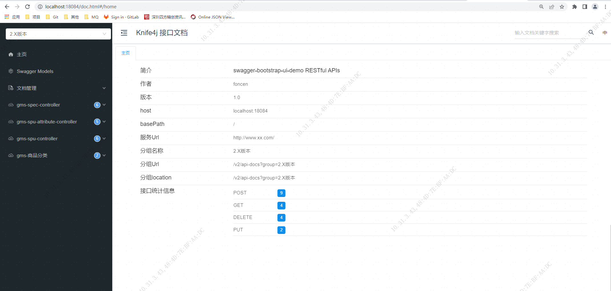
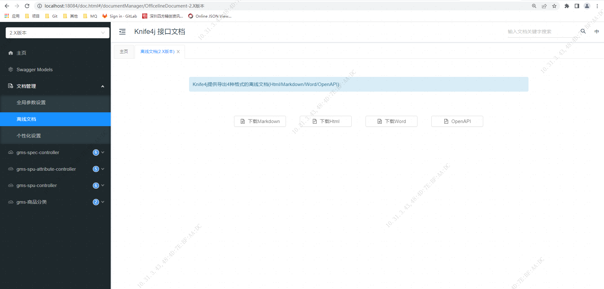
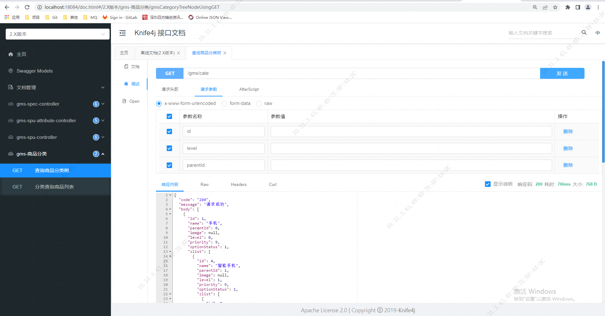

= knife4j api接口可视化
foncen
:doctype: book"
:idprefix: knife4j
:idseparator: -
:toc: left
:toclevels: 5
:toc-title: knife4j
:icons: font
:project-full-name: knife4j 接口可视化
:favicon: ../images/canal/favicon.png

== knife4j 简介
TIP: Knife4j的前身是swagger-bootstrap-ui,前身swagger-bootstrap-ui是一个纯swagger-ui的ui皮肤项目
****
 项目正式更名为knife4j,取名knife4j是希望她能像一把匕首一样小巧,轻量,并且功能强悍,更名也是希望把她做成一个为Swagger接口文档服务的通用性解决方案,不仅仅只是专注于前端Ui前端.

swagger-bootstrap-ui的所有特性都会集中在knife4j-spring-ui包中,并且后续也会满足开发者更多的个性化需求.
****
== 引入knife4j
****
.knife4j mall-master.pom 版本管理
[source,xml]
----
            <!--   knife4j         -->
            <dependency>
                <groupId>com.github.xiaoymin</groupId>
                <artifactId>knife4j-spring-boot-starter</artifactId>
                <version>${knife4j.version}</version>
            </dependency>
----
.mall-gms.pom 引入
[source,xml]
----
         <!--  knife4j api可视化     -->
        <dependency>
            <groupId>com.github.xiaoymin</groupId>
            <artifactId>knife4j-spring-boot-starter</artifactId>
        </dependency>
----
****

== 项目配置 knife4j
****
创建Swagger配置依赖

.Knife4jConfiguration
[source,java]
----
package com.formssi.mall.goods.infrastructure.config;

import org.springframework.context.annotation.Bean;
import org.springframework.context.annotation.Configuration;
import springfox.documentation.builders.ApiInfoBuilder;
import springfox.documentation.builders.PathSelectors;
import springfox.documentation.builders.RequestHandlerSelectors;
import springfox.documentation.spi.DocumentationType;
import springfox.documentation.spring.web.plugins.Docket;
import springfox.documentation.service.Contact;
import springfox.documentation.swagger2.annotations.EnableSwagger2WebMvc;

/**
 * @author:prms
 * @create: 2022-05-18 09:45
 * @version: 1.0
 */
@Configuration
@EnableSwagger2WebMvc
public class Knife4jConfiguration {

    @Bean(value = "defaultApi2")
    public Docket defaultApi2() {
        Docket docket = new Docket(DocumentationType.SWAGGER_2)
                .apiInfo(new ApiInfoBuilder()
                        //.title("swagger-bootstrap-ui-demo RESTful APIs")
                        .description("# swagger-bootstrap-ui-demo RESTful APIs")
                        .termsOfServiceUrl("http://www.xx.com/")
                        .contact(new Contact("foncen", "", "xx@qq.com"))
                        .version("1.0")
                        .build())
                //分组名称
                .groupName("2.X版本")
                .select()
                //这里指定Controller扫描包路径
                .apis(RequestHandlerSelectors.basePackage("com.formssi.mall.goods.interfaces"))
                .paths(PathSelectors.any())
                .build();
        return docket;
    }
}

----
****
== 使用
****
IndexController.java包含一个简单的RESTful接口,代码示例如下：
.例
[source,java]
----
@Api(tags = "首页模块")
@RestController
public class IndexController {

    @ApiImplicitParam(name = "name",value = "姓名",required = true)
    @ApiOperation(value = "向客人问好")
    @GetMapping("/sayHi")
    public ResponseEntity<String> sayHi(@RequestParam(value = "name")String name){
        return ResponseEntity.ok("Hi:"+name);
    }
}
----
****
== 启动项目
****
* ctrl+f9  编译项目,刷新静态资源
* 启动 GoodsApplication
* 访问rul: http://10.31.3.43:18084/doc.html

****
== 功能
****
* 文档导出

* 接口调试

****
== 注:
****
TIP: 如果springboot 版本为 2.6.x 以上,需要设置路径匹配模式 ant_path_matcher
mvc.pathmatch.matching-strategy=ant_path_matcher   # knife4j 静态资源匹配模式
****

== end
