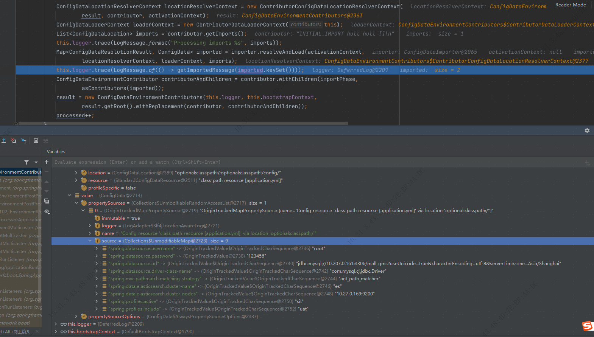

= springboot 启动
foncen
:doctype: book"
:idprefix: springboot
:idseparator: -
:toc: left
:toclevels: 5
:toc-title: sprignboot启动
:icons: font
:project-full-name: springboot 启动
:favicon: ../images/canal/favicon.png
:sectanchors:
:sectnums:

== 1. springboot 启动原理
.程序入口
[source,java]
----
public static void main(String[] args) {
		SpringApplication.run(FoncenBootApplication.class, args);
	}
----
TIP: springboot 启动是通过调用 SpringApplication 的静态 run() 方法启动的,run方法里里边分成两步,首先是创建 SpringApplication 对象,然后调用 SpringApplication 对象的run方法

.run()
[source,java]
----
/**
	 * Static helper that can be used to run a {@link SpringApplication} from the
	 * specified sources using default settings and user supplied arguments.
	 * @param primarySources the primary sources to load
	 * @param args the application arguments (usually passed from a Java main method)
	 * @return the running {@link ApplicationContext}
	 */
	public static ConfigurableApplicationContext run(Class<?>[] primarySources, String[] args) {
		return new SpringApplication(primarySources).run(args);
	}
----
=== 1.1 创建 SpringApplication 对象
.创建对象过程
[source,java]
----
/**
	 * Create a new {@link SpringApplication} instance. The application context will load
	 * beans from the specified primary sources (see {@link SpringApplication class-level}
	 * documentation for details). The instance can be customized before calling
	 * {@link #run(String...)}.
	 * @param resourceLoader the resource loader to use
	 * @param primarySources the primary bean sources
	 * @see #run(Class, String[])
	 * @see #setSources(Set)
	 */
	@SuppressWarnings({ "unchecked", "rawtypes" })
	public SpringApplication(ResourceLoader resourceLoader, Class<?>... primarySources) {
		this.resourceLoader = resourceLoader;
		Assert.notNull(primarySources, "PrimarySources must not be null");
		this.primarySources = new LinkedHashSet<>(Arrays.asList(primarySources));   //把启动类加入源数组
		this.webApplicationType = WebApplicationType.deduceFromClasspath();  //推断启动应用类型
		this.bootstrapRegistryInitializers = new ArrayList<>(
				getSpringFactoriesInstances(BootstrapRegistryInitializer.class));  //加载启动上下文初始化器
		setInitializers((Collection) getSpringFactoriesInstances(ApplicationContextInitializer.class)); //加载应用上下文初始化器
		setListeners((Collection) getSpringFactoriesInstances(ApplicationListener.class)); //加载应用监听器
		this.mainApplicationClass = deduceMainApplicationClass(); //推断入口主类
	}
----
==== 1.1.1 推断启动应用类型
.类型
[source,java]
----
/**
	 * The application should not run as a web application and should not start an
	 * embedded web server.
	 */
	NONE,

	/**
	 * The application should run as a servlet-based web application and should start an
	 * embedded servlet web server.
	 */
	SERVLET,

	/**
	 * The application should run as a reactive web application and should start an
	 * embedded reactive web server.
	 */
	REACTIVE;
----
TIP: SERVLET类型必须的两个类 Servlet 和 ConfigurableWebApplicationContext
[source,java]
----
private static final String[] SERVLET_INDICATOR_CLASSES = { "javax.servlet.Servlet",
			"org.springframework.web.context.ConfigurableWebApplicationContext" };
----
.推断过程
[source,java]
----
static WebApplicationType deduceFromClasspath() {
		if (ClassUtils.isPresent(WEBFLUX_INDICATOR_CLASS, null) && !ClassUtils.isPresent(WEBMVC_INDICATOR_CLASS, null)
				&& !ClassUtils.isPresent(JERSEY_INDICATOR_CLASS, null)) {
			return WebApplicationType.REACTIVE;
		}
		for (String className : SERVLET_INDICATOR_CLASSES) {
			if (!ClassUtils.isPresent(className, null)) {
				return WebApplicationType.NONE;  // 不满足条件
			}
		}
		return WebApplicationType.SERVLET;
	}
----
==== 1.1.2 加载启动上下文初始化器
TIP: 通过 spi 机制 加载 BootstrapRegistryInitializer.class 的实现类
****
 getSpringFactoriesInstances(ApplicationContextInitializer.class) 方法跟进去能看到如下代码

****
[source,java]
----
private <T> Collection<T> getSpringFactoriesInstances(Class<T> type, Class<?>[] parameterTypes, Object... args) {
		ClassLoader classLoader = getClassLoader(); // 防止加载失败,使用线程上下文加载器,打破双亲委派加载机制,类似的还有 jdbc 驱动的加载
		// Use names and ensure unique to protect against duplicates
		Set<String> names = new LinkedHashSet<>(SpringFactoriesLoader.loadFactoryNames(type, classLoader));  //扫描factories文件并缓存
		List<T> instances = createSpringFactoriesInstances(type, parameterTypes, classLoader, args, names);  //实例化实现类
		AnnotationAwareOrderComparator.sort(instances); //注解排序
		return instances;
	}
----
===== 1.1.2.1 类加载器
[source,java]
----
/**
	 * Either the ClassLoader that will be used in the ApplicationContext (if
	 * {@link #setResourceLoader(ResourceLoader) resourceLoader} is set), or the context
	 * class loader (if not null), or the loader of the Spring {@link ClassUtils} class.
	 * @return a ClassLoader (never null)
	 */
	public ClassLoader getClassLoader() {
		if (this.resourceLoader != null) {
			return this.resourceLoader.getClassLoader();
		}
		return ClassUtils.getDefaultClassLoader();
	}
----
[source,java]
----
/**
	 * Return the default ClassLoader to use: typically the thread context
	 * ClassLoader, if available; the ClassLoader that loaded the ClassUtils
	 * class will be used as fallback.
	 * 
Call this method if you intend to use the thread context ClassLoader
	 * in a scenario where you clearly prefer a non-null ClassLoader reference:
	 * for example, for class path resource loading (but not necessarily for
	 * {@code Class.forName}, which accepts a {@code null} ClassLoader
	 * reference as well).
	 * @return the default ClassLoader (only {@code null} if even the system
	 * ClassLoader isn't accessible)
	 * @see Thread#getContextClassLoader()
	 * @see ClassLoader#getSystemClassLoader()
	 */
	@Nullable
	public static ClassLoader getDefaultClassLoader() {
		ClassLoader cl = null;
		try {
			cl = Thread.currentThread().getContextClassLoader();  //可以看到,这里直接返回当前线程的类加载器
		}
		catch (Throwable ex) {
			// Cannot access thread context ClassLoader - falling back...
		}
		if (cl == null) {
			// No thread context class loader -> use class loader of this class.
			cl = ClassUtils.class.getClassLoader();
			if (cl == null) {
				// getClassLoader() returning null indicates the bootstrap ClassLoader
				try {
					cl = ClassLoader.getSystemClassLoader();
				}
				catch (Throwable ex) {
					// Cannot access system ClassLoader - oh well, maybe the caller can live with null...
				}
			}
		}
		return cl;
	}
----
===== 1.1.2.2 扫描factories文件并缓存
TIP: SpringFactoriesLoader.loadFactoryNames(type, classLoader)
[source,java]
----

	public static List<String> loadFactoryNames(Class<?> factoryType, @Nullable ClassLoader classLoader) {
		ClassLoader classLoaderToUse = classLoader;
		if (classLoaderToUse == null) {
			classLoaderToUse = SpringFactoriesLoader.class.getClassLoader();
		}
		String factoryTypeName = factoryType.getName();
		return loadSpringFactories(classLoaderToUse).getOrDefault(factoryTypeName, Collections.emptyList());  //这一步加载所有meta-info下的 factories 文件
	}

// getOrDefault(factoryTypeName, Collections.emptyList()) 筛选出出需要的类名
----
TIP: springboot spi 默认加载路径
****
 public static final String FACTORIES_RESOURCE_LOCATION = "META-INF/spring.factories";
****
[source,java]
----
private static Map<String, List<String>> loadSpringFactories(ClassLoader classLoader) {
		Map<String, List<String>> result = cache.get(classLoader);  //查看加载缓存,已缓存则直接返回
		if (result != null) {
			return result;
		}

		result = new HashMap<>();
		try {
			Enumeration<URL> urls = classLoader.getResources(FACTORIES_RESOURCE_LOCATION);
			while (urls.hasMoreElements()) {
				URL url = urls.nextElement();
				UrlResource resource = new UrlResource(url);  //获取资源文件流
				Properties properties = PropertiesLoaderUtils.loadProperties(resource); // 实现 Properties直接解析文件流,获得 properties 对象

              // 多个实现用逗号分开,处理映射成 map 返回
				for (Map.Entry<?, ?> entry : properties.entrySet()) {
					String factoryTypeName = ((String) entry.getKey()).trim();
					String[] factoryImplementationNames =
							StringUtils.commaDelimitedListToStringArray((String) entry.getValue());
					for (String factoryImplementationName : factoryImplementationNames) {
						result.computeIfAbsent(factoryTypeName, key -> new ArrayList<>())
								.add(factoryImplementationName.trim());
					}
				}
			}

			// Replace all lists with unmodifiable lists containing unique elements
			result.replaceAll((factoryType, implementations) -> implementations.stream().distinct()
					.collect(Collectors.collectingAndThen(Collectors.toList(), Collections::unmodifiableList)));
			cache.put(classLoader, result);  //缓存结果
		}
		catch (IOException ex) {
			throw new IllegalArgumentException("Unable to load factories from location [" +
					FACTORIES_RESOURCE_LOCATION + "]", ex);
		}
		return result;
	}
----
TIP: List<T> instances = createSpringFactoriesInstances(type, parameterTypes, classLoader, args, names);

.BeanUtils.instantiateClass(constructor, args)
[source,java]
----
private <T> List<T> createSpringFactoriesInstances(Class<T> type, Class<?>[] parameterTypes,
			ClassLoader classLoader, Object[] args, Set<String> names) {
		List<T> instances = new ArrayList<>(names.size());
		for (String name : names) {
			try {
				Class<?> instanceClass = ClassUtils.forName(name, classLoader);
				Assert.isAssignable(type, instanceClass);
				Constructor<?> constructor = instanceClass.getDeclaredConstructor(parameterTypes);
				T instance = (T) BeanUtils.instantiateClass(constructor, args);  //类名反射实例化对象
				instances.add(instance);
			}
			catch (Throwable ex) {
				throw new IllegalArgumentException("Cannot instantiate " + type + " : " + name, ex);
			}
		}
		return instances;
	}
----
TIP: 此处没有启动上下文初始化器,feign,或者dubbo客户端有对应的实现

==== 1.1.3 加载应用上下文初始化器
TIP: setInitializers((Collection) getSpringFactoriesInstances(ApplicationContextInitializer.class));
****
同上,也是通过 spi 机制加载实例化应用上下文初始化器
****

==== 1.1.4 加载应用监听器
TIP: setListeners((Collection) getSpringFactoriesInstances(ApplicationListener.class));
****
 spi 机制加载实例化 ApplicationListener.class 的实现类
****

==== 1.1.5 推断入口主类
TIP: 遍历线程栈获取main方法线程得到启动类
[source,java]
----
StackTraceElement[] stackTrace = new RuntimeException().getStackTrace();
			for (StackTraceElement stackTraceElement : stackTrace) {
				if ("main".equals(stackTraceElement.getMethodName())) {
                    // 线程栈信息 筛选进栈方法名为 mian 的栈信息
					return Class.forName(stackTraceElement.getClassName());
				}
			}
----

=== 1.2 运行 SpringApplication 的 run 方法
TIP: run方法的主要过程为 构造启动上下文,构造应用上下文,发布事件和刷新应用上下文

[source,java]
----
public ConfigurableApplicationContext run(String... args) {
		long startTime = System.nanoTime();
		DefaultBootstrapContext bootstrapContext = createBootstrapContext();  //创建启动上下文
		ConfigurableApplicationContext context = null;
		configureHeadlessProperty();
		SpringApplicationRunListeners listeners = getRunListeners(args);  //spi 加载运行时监听器
		listeners.starting(bootstrapContext, this.mainApplicationClass);
        // 发布启动上下文开始事件
		try {
			ApplicationArguments applicationArguments = new DefaultApplicationArguments(args);
			ConfigurableEnvironment environment = prepareEnvironment(listeners, bootstrapContext, applicationArguments);
            //准备上下文环境并发布准备事件
			configureIgnoreBeanInfo(environment);
			Banner printedBanner = printBanner(environment);
			context = createApplicationContext(); //创建应用上下文
			context.setApplicationStartup(this.applicationStartup);
			prepareContext(bootstrapContext, context, environment, listeners, applicationArguments, printedBanner);
            //准备应用上下文,同事关闭启动上下文,发布关闭事件
			refreshContext(context); //刷新上下文,springboot 最重要的部分
			afterRefresh(context, applicationArguments);
			Duration timeTakenToStartup = Duration.ofNanos(System.nanoTime() - startTime);
			if (this.logStartupInfo) {
				new StartupInfoLogger(this.mainApplicationClass).logStarted(getApplicationLog(), timeTakenToStartup);
			}
			listeners.started(context, timeTakenToStartup); //发布应用上下文开始事件
			callRunners(context, applicationArguments);
		}
		catch (Throwable ex) {
			handleRunFailure(context, ex, listeners);
			throw new IllegalStateException(ex);
		}
		try {
			Duration timeTakenToReady = Duration.ofNanos(System.nanoTime() - startTime);
			listeners.ready(context, timeTakenToReady);
		}
		catch (Throwable ex) {
			handleRunFailure(context, ex, null);
			throw new IllegalStateException(ex);
		}
		return context;
	}
----
==== 1.2.1 构造启动上下文
TIP: 构造默认启动上下文,发布启动上下文开始事件
.DefaultBootstrapContext
[source,java]
----
private DefaultBootstrapContext createBootstrapContext() {
		DefaultBootstrapContext bootstrapContext = new DefaultBootstrapContext(); //构造默认启动上下文
		this.bootstrapRegistryInitializers.forEach((initializer) -> initializer.initialize(bootstrapContext));
        //调用初始化器的初始化方法  initialize
		return bootstrapContext;
	}
----
==== 1.2.2 加载运行时监听器
TIP: spi 加载 SpringApplicationRunListener.class 的实现实例
[source,java]
----
private SpringApplicationRunListeners getRunListeners(String[] args) {
		Class<?>[] types = new Class<?>[] { SpringApplication.class, String[].class };
		return new SpringApplicationRunListeners(logger,
				getSpringFactoriesInstances(SpringApplicationRunListener.class, types, this, args),
				this.applicationStartup);
	}
----
==== 1.2.3 发布开始事件
TIP: listeners.starting(bootstrapContext, this.mainApplicationClass);

* SpringApplication 持有 SpringApplicationRunListeners 对象
* SpringApplicationRunListeners 对象持有 SpringApplicationRunListener.class 实例
* 遍历监听器集合发布开始事件
[source,java]
----
private void doWithListeners(String stepName, Consumer<SpringApplicationRunListener> listenerAction,
			Consumer<StartupStep> stepAction) {
		StartupStep step = this.applicationStartup.start(stepName);
		this.listeners.forEach(listenerAction);  // 函数是接口
		if (stepAction != null) {
			stepAction.accept(step);
		}
		step.end();
	}
----
.listenerAction
[source,java]
----
(listener) -> listener.starting(bootstrapContext)
----
.发布staring事件
[source,java]
----
public void starting(ConfigurableBootstrapContext bootstrapContext) {
		this.initialMulticaster
				.multicastEvent(new ApplicationStartingEvent(bootstrapContext, this.application, this.args));
	}
----
.筛选监听器并调用监听器
[source,java]
----
public void multicastEvent(final ApplicationEvent event, @Nullable ResolvableType eventType) {
		ResolvableType type = (eventType != null ? eventType : resolveDefaultEventType(event));
		Executor executor = getTaskExecutor();
		for (ApplicationListener<?> listener : getApplicationListeners(event, type)) {  //筛选监听器
			if (executor != null) {
				executor.execute(() -> invokeListener(listener, event));
			}
			else {
				invokeListener(listener, event);  //遍历调用监听器
			}
		}
	}
----

****
筛选出三个监听器,分别遍历处理 ApplicationStartingEvent 事件,这里除了日志初始化之外,其他两个监听器没有做任何处理
****

TIP: ApplicationEvent 事件的实现类

image::../images/boot/event_img.png[事件]

TIP: AbstractApplicationEventMulticaster 观察者模式的观察者,实现类是SimpleApplicationEventMulticaster,发布事件
.发布事件
[source,java]
----
      @Override
	public void multicastEvent(ApplicationEvent event) {
		multicastEvent(event, resolveDefaultEventType(event));
	}
----
==== 1.2.4 解析并封装封装 main 方法 参数
****
    ApplicationArguments applicationArguments = new DefaultApplicationArguments(args);
****
TIP: java -jar xxx.jar  启动jar包时传入的参数,比如--server.port = 8080

==== 1.2.5 准备环境
****
prepareEnvironment(listeners, bootstrapContext, applicationArguments);
****
===== 1.2.5.1 根据前面推断的web类型构建环境
[source,Java]
----
private ConfigurableEnvironment getOrCreateEnvironment() {
		if (this.environment != null) {
			return this.environment;
		}
		switch (this.webApplicationType) {
		case SERVLET:
			return new ApplicationServletEnvironment();
		case REACTIVE:
			return new ApplicationReactiveWebEnvironment();
		default:
			return new ApplicationEnvironment();
		}
	}
----
TIP: 构建 ApplicationServletEnvironment 环境

NOTE: jndi 知识点
[source,java]
----
// Defensive reference to JNDI API for JDK 9+ (optional java.naming module)
	private static final boolean jndiPresent = ClassUtils.isPresent(
			"javax.naming.InitialContext", StandardServletEnvironment.class.getClassLoader());
----
****
    使用LDAP+JNDI Reference的方式，在JDK 11.0.1、8u191、7u201、6u211后被限制,今年的 log4j 注入的安全问题

****
===== 1.2.5.2 环境配置属性
.属性
[source,java]
----
private final Set<String> activeProfiles = new LinkedHashSet<>(); //激活的选择配置文件集合

	private final Set<String> defaultProfiles = new LinkedHashSet<>(getReservedDefaultProfiles());  //default

	private final MutablePropertySources propertySources; 标有 propertysource 和 propertysources 注解的配置引入

	private final ConfigurablePropertyResolver propertyResolver;  配置文件查找器
----
TIP: 默认附加加载配置文件后缀 default,后面会看到springboot默认加载配置文件名为 application的配置文件

TIP: 解析器可以查找并执行el表达式替换结果

TIP: 加载环境变量一览

****
四个变量参数,前两个与servlet相关,为空Object对象,后两个分别为系统环境变量和系统属性变量,其中非 jndi 环境,跳过了 jndi 属性加载
****
==== 1.2.6 配置环境
****
configureEnvironment(environment, applicationArguments.getSourceArgs());
****
[source,java]
----
protected void configureEnvironment(ConfigurableEnvironment environment, String[] args) {
		if (this.addConversionService) {
			environment.setConversionService(new ApplicationConversionService());   配置应用转换器
		}
		configurePropertySources(environment, args); 配置PropertySources
		configureProfiles(environment, args); 配置Profiles
	}
----
===== 1.2.6.1 配置转换器
[source,java]
----
	/**
	 * Configure the given {@link FormatterRegistry} with formatters and converters
	 * appropriate for most Spring Boot applications.
	 * @param registry the registry of converters to add to (must also be castable to
	 * ConversionService, e.g. being a {@link ConfigurableConversionService})
	 * @throws ClassCastException if the given FormatterRegistry could not be cast to a
	 * ConversionService
	 */
	public static void configure(FormatterRegistry registry) {
		DefaultConversionService.addDefaultConverters(registry); //默认转换器
		DefaultFormattingConversionService.addDefaultFormatters(registry);  //默认格式化器
		addApplicationFormatters(registry); // 格式化器注册
		addApplicationConverters(registry);//添加转换器注册
	}
----
.添加默认转换器
[source,java]
----
public static void addDefaultConverters(ConverterRegistry converterRegistry) {
		addScalarConverters(converterRegistry);
		addCollectionConverters(converterRegistry);

		converterRegistry.addConverter(new ByteBufferConverter((ConversionService) converterRegistry));
		converterRegistry.addConverter(new StringToTimeZoneConverter());
		converterRegistry.addConverter(new ZoneIdToTimeZoneConverter());
		converterRegistry.addConverter(new ZonedDateTimeToCalendarConverter());

		converterRegistry.addConverter(new ObjectToObjectConverter());
		converterRegistry.addConverter(new IdToEntityConverter((ConversionService) converterRegistry));
		converterRegistry.addConverter(new FallbackObjectToStringConverter());
		converterRegistry.addConverter(new ObjectToOptionalConverter((ConversionService) converterRegistry));
	}
----
****
转换器

一共有167 个转换器,支持很多类型转换和格式化,其中还可以通过实现 webmvcconfigure 接口添加自定义的转换器和格式化.

在 mvc参数解析的时候会根据对应的映射拿到转换处理器解析和格式化参数
****
==== 1.2.7 附加默认配置支持特殊环境
TIP: ConfigurationPropertySources.attach(environment);

****
Attach a ConfigurationPropertySource support to the specified Environment.
实际上是把之前的 propertysourceList 重新封装到一个 ConfigurationPropertySource 里边
****
==== 1.2.8 发布环境准备事件
[source,java]
----
listeners.environmentPrepared(bootstrapContext, environment);
----
TIP: ApplicationEnvironmentPreparedEvent 事件

****
同上,筛选出6个监听器

image::../images/boot/prepared_img.png[准备]
这里主要关注第一个监听器的处理.

.getEnvironmentPostProcessors 获取环境后处理器
[source,java]
----
private void onApplicationEnvironmentPreparedEvent(ApplicationEnvironmentPreparedEvent event) {
		ConfigurableEnvironment environment = event.getEnvironment();
		SpringApplication application = event.getSpringApplication();
		for (EnvironmentPostProcessor postProcessor : getEnvironmentPostProcessors(application.getResourceLoader(),
				event.getBootstrapContext())) {
			postProcessor.postProcessEnvironment(environment, application);
		}
	}
----
[source,java]
----
List<EnvironmentPostProcessor> getEnvironmentPostProcessors(ResourceLoader resourceLoader,
			ConfigurableBootstrapContext bootstrapContext) {
		ClassLoader classLoader = (resourceLoader != null) ? resourceLoader.getClassLoader() : null;
		EnvironmentPostProcessorsFactory postProcessorsFactory = this.postProcessorsFactory.apply(classLoader);  //获取处理器工厂
		return postProcessorsFactory.getEnvironmentPostProcessors(this.deferredLogs, bootstrapContext);
	}
----
.postProcessorsFactory 是一个Function集合,Function是这个工厂的策略实现,当前只有一个初始化实现,通过spi机制拿到后处理器实例名,然后实例化
[source,java]
----
private final Function<ClassLoader, EnvironmentPostProcessorsFactory> postProcessorsFactory;

	/**
	 * Create a new {@link EnvironmentPostProcessorApplicationListener} with
	 * {@link EnvironmentPostProcessor} classes loaded via {@code spring.factories}.
	 */
	public EnvironmentPostProcessorApplicationListener() {
		this((classLoader) -> EnvironmentPostProcessorsFactory.fromSpringFactories(classLoader), new DeferredLogs());
	}
----

 这里主要关注 ConfigDataEnvironmentPostProcessor 处理器的
 getConfigDataEnvironment(environment, resourceLoader, additionalProfiles).processAndApply(); 方法, 加载并解析配置文件

创建配置数据环境

.getConfigDataEnvironment
[source,java]
----
ConfigDataEnvironment getConfigDataEnvironment(ConfigurableEnvironment environment, ResourceLoader resourceLoader,
			Collection<String> additionalProfiles) {
		return new ConfigDataEnvironment(this.logFactory, this.bootstrapContext, environment, resourceLoader,
				additionalProfiles, this.environmentUpdateListener);
	}
----
TIP: 初始化添加默认加载路径,optional 表示可选的,不存在不会抛出异常
[source,java]
----
static {
		List<ConfigDataLocation> locations = new ArrayList<>();
		locations.add(ConfigDataLocation.of("optional:classpath:/;optional:classpath:/config/"));
		locations.add(ConfigDataLocation.of("optional:file:./;optional:file:./config/;optional:file:./config/*/"));
		DEFAULT_SEARCH_LOCATIONS = locations.toArray(new ConfigDataLocation[0]);
	}
----
其中有一个配置数据路径查找器

查找器有两个,一个是树结构查找器,一个是标准查找器

image::../images/boot/config_resolve_img.png[查找器]
.标准查找器
[source,java]
----
private String[] getConfigNames(Binder binder) {
		String[] configNames = binder.bind(CONFIG_NAME_PROPERTY, String[].class).orElse(DEFAULT_CONFIG_NAMES); //spring.config.name 如果没有指定则返回默认的 application 名字
		for (String configName : configNames) {
			validateConfigName(configName);
		}
		return configNames;
	}
----
image::../images/boot/config_name_img.png[config]
image::../images/boot/application_img.png[application]

然后是创建对应的数据加载器

创建树结构的配置数据贡献器

.contibutos
[source,java]
----
private ConfigDataEnvironmentContributors createContributors(Binder binder) {
		this.logger.trace("Building config data environment contributors");
		MutablePropertySources propertySources = this.environment.getPropertySources();
		List<ConfigDataEnvironmentContributor> contributors = new ArrayList<>(propertySources.size() + 10);
		PropertySource<?> defaultPropertySource = null;
		for (PropertySource<?> propertySource : propertySources) {
            // 有六个已经存在的资源propertySource
			if (DefaultPropertiesPropertySource.hasMatchingName(propertySource)) {
				defaultPropertySource = propertySource;
			}
			else {
				this.logger.trace(LogMessage.format("Creating wrapped config data contributor for '%s'",
						propertySource.getName()));
				contributors.add(ConfigDataEnvironmentContributor.ofExisting(propertySource));
                //对已存在的资源创建 Existing 类型的 contributos
			}
		}
		contributors.addAll(getInitialImportContributors(binder));
        // 添加引入初始化的contibutos
		if (defaultPropertySource != null) {
			this.logger.trace("Creating wrapped config data contributor for default property source");
			contributors.add(ConfigDataEnvironmentContributor.ofExisting(defaultPropertySource));
		}
		return createContributors(contributors);
	}
----
TIP: 为已加载的资源创建contributor,对应的location,resource和properties 都为null
image:../images/boot/exist_contibutos.png[existing]

.DEFAULT_SEARCH_LOCATIONS
[source,java]
----
static {
                List<ConfigDataLocation> locations = new ArrayList<>();
                locations.add(ConfigDataLocation.of("optional:classpath:/;optional:classpath:/config/"));
                locations.add(ConfigDataLocation.of("optional:file:./;optional:file:./config/;optional:file:./config/*/"));
                DEFAULT_SEARCH_LOCATIONS = locations.toArray(new ConfigDataLocation[0]);
        }
----

image:../images/boot/contibutors_img.png[contributos]

.processAndApply
[source,java]
----
	/**
	 * Process all contributions and apply any newly imported property sources to the
	 * {@link Environment}.
	 */
	void processAndApply() {
		ConfigDataImporter importer = new ConfigDataImporter(this.logFactory, this.notFoundAction, this.resolvers,
				this.loaders);  //创建数据导入器
		registerBootstrapBinder(this.contributors, null, DENY_INACTIVE_BINDING); //注册绑定contributors
		ConfigDataEnvironmentContributors contributors = processInitial(this.contributors, importer); active 之前初始化contributors
		ConfigDataActivationContext activationContext = createActivationContext(
				contributors.getBinder(null, BinderOption.FAIL_ON_BIND_TO_INACTIVE_SOURCE)); // 创建可用上下文
		contributors = processWithoutProfiles(contributors, importer, activationContext);
		activationContext = withProfiles(contributors, activationContext);
		contributors = processWithProfiles(contributors, importer, activationContext);
		applyToEnvironment(contributors, activationContext, importer.getLoadedLocations(),
				importer.getOptionalLocations());
	}
----
TIP:  创建数据导入器 ConfigDataImporter,主要参数有查找器,数据加载器
[source,java]
----
ConfigDataImporter(DeferredLogFactory logFactory, ConfigDataNotFoundAction notFoundAction,
			ConfigDataLocationResolvers resolvers, ConfigDataLoaders loaders) {
		this.logger = logFactory.getLog(getClass());
		this.resolvers = resolvers;
		this.loaders = loaders;
		this.notFoundAction = notFoundAction;
	}
----
TIP: registerBootstrapBinder(this.contributors, null, DENY_INACTIVE_BINDING); 为当前数据贡献器注册绑定操作
[source,java]
----
enum BinderOption {

		/**
		 * Throw an exception if an inactive contributor contains a bound value.
		 */
		FAIL_ON_BIND_TO_INACTIVE_SOURCE;

	}
----
TIP: processInitial(this.contributors, importer); active 之前 contibutors初始化处理
[source,java]
----
private ConfigDataEnvironmentContributors processInitial(ConfigDataEnvironmentContributors contributors,
			ConfigDataImporter importer) {
		this.logger.trace("Processing initial config data environment contributors without activation context");
        //非active数据导入处理
		contributors = contributors.withProcessedImports(importer, null);
        // 注册贡献器处理绑定
		registerBootstrapBinder(contributors, null, DENY_INACTIVE_BINDING);
		return contributors;
	}
----
NOTE: 初始化处理主要看 contributors.withProcessedImports(importer, null);

.contributors
[source,java]
----
ConfigDataEnvironmentContributors withProcessedImports(ConfigDataImporter importer,
			ConfigDataActivationContext activationContext) {
		ImportPhase importPhase = ImportPhase.get(activationContext);
		this.logger.trace(LogMessage.format("Processing imports for phase %s. %s", importPhase,
				(activationContext != null) ? activationContext : "no activation context"));
		ConfigDataEnvironmentContributors result = this;
		int processed = 0;
		while (true) {
			ConfigDataEnvironmentContributor contributor = getNextToProcess(result, activationContext, importPhase);
            //循环遍历获取需要加载的contributor
			if (contributor == null) {
				this.logger.trace(LogMessage.format("Processed imports for of %d contributors", processed));
				return result;
			}
			if (contributor.getKind() == Kind.UNBOUND_IMPORT) {
                // contributor 类型UNBOUND_IMPORT 的进行绑定处理
				ConfigDataEnvironmentContributor bound = contributor.withBoundProperties(result, activationContext);
				result = new ConfigDataEnvironmentContributors(this.logger, this.bootstrapContext,
						result.getRoot().withReplacement(contributor, bound));
				continue;
			}
			ConfigDataLocationResolverContext locationResolverContext = new ContributorConfigDataLocationResolverContext(
					result, contributor, activationContext);
			ConfigDataLoaderContext loaderContext = new ContributorDataLoaderContext(this);
			List<ConfigDataLocation> imports = contributor.getImports();
			this.logger.trace(LogMessage.format("Processing imports %s", imports));
            //查找并加载数据
			Map<ConfigDataResolutionResult, ConfigData> imported = importer.resolveAndLoad(activationContext,
					locationResolverContext, loaderContext, imports);
			this.logger.trace(LogMessage.of(() -> getImportedMessage(imported.keySet())));
			ConfigDataEnvironmentContributor contributorAndChildren = contributor.withChildren(importPhase,
					asContributors(imported));
			result = new ConfigDataEnvironmentContributors(this.logger, this.bootstrapContext,
					result.getRoot().withReplacement(contributor, contributorAndChildren));
			processed++;
		}
	}
----
TIP: 推断导入阶段,只有两个阶段,未激活和激活阶段
[source,java]
----
		/**
		 * Return the {@link ImportPhase} based on the given activation context.
		 * @param activationContext the activation context
		 * @return the import phase
		 */
		static ImportPhase get(ConfigDataActivationContext activationContext) {
			if (activationContext != null && activationContext.getProfiles() != null) {
				return AFTER_PROFILE_ACTIVATION;  //激活active 阶段
			}
			return BEFORE_PROFILE_ACTIVATION; // 未激活阶段
		}
----

TIP: 遍历筛选 UNBOUND_IMPORT 类型的 contibutor 或未处理的active contibutor

NOTE: 初始化主要是对外部文件和类路径文件进行加载,加载文件名为application,此时profile为null,即加载acitve之前.
image:../images/boot/contributor_profile_img.png[profiel]
[source,java]
----
String profileSuffix = (StringUtils.hasText(profile)) ? "-" + profile : ""; //前缀
		this.resourceLocation = root + profileSuffix + ((extension != null) ? "." + extension : ""); //资源 urlclasspath:/application,具体的文件格式会遍历数据加载器加载相应格式的配置文件
----
NOTE: 当前外部文件为空,类路径加载资源如下

 配置文件数据加载完成之后都会解析成map然后封装成对应的protertySource

TIP: 资源加载进来之后会封装成一个contributor ,然后替换更新contributors 树
[source,java]
----
Map<ConfigDataResolutionResult, ConfigData> imported = importer.resolveAndLoad(activationContext,
					locationResolverContext, loaderContext, imports);
			this.logger.trace(LogMessage.of(() -> getImportedMessage(imported.keySet()))); //加载资源配置
			ConfigDataEnvironmentContributor contributorAndChildren = contributor.withChildren(importPhase,
					asContributors(imported));  //把当前资源封装为contributor
			result = new ConfigDataEnvironmentContributors(this.logger, this.bootstrapContext,
					result.getRoot().withReplacement(contributor, contributorAndChildren));  //替换并更新 contributors
----
TIP: 这里可看到是把资源封装成 UNBOUND_IMPORT 类型的contributor,然后在contributors的遍历中会对此类型的contributor 进行处理

TIP: 初始化完成之后是构建 active 上下文
[source,java]
----
ConfigDataActivationContext activationContext = createActivationContext(
				contributors.getBinder(null, BinderOption.FAIL_ON_BIND_TO_INACTIVE_SOURCE));  //构建 active 上下文
----
NOTE: 知识点 > 其中有一个推断 cloudPlatform 云平台类型的方法,这个目前还不知道怎么用,先做个简单的了解

TIP: cloudPlatform 介绍:Cloud-Platform是国内首个基于Spring Cloud微服务化开发平台，具有统一授权、认证后台管理系统，其中包含具备用户管理、资源权限管理、网关API 管理等多个模块，支持多业务系统并行开发，可以作为后端服务的开发脚手架。

cloudPlatform 类型可以通过spring.main.cloud-platform指定,目前支持的类型有:
image:../images/boot/Type_of_cloudPlatform_img.png[tycl]

TIP: 构建active上下文之后
[source,java]
----
contributors = processWithoutProfiles(contributors, importer, activationContext);  // 这一步主要是构建active上下文之后再次处理一下环境数据,实际上没有什么处理.
----
TIP: 继续处理配置文件
[source,java]
----
activationContext = withProfiles(contributors, activationContext); //处理profiles
----
[source,java]
----
private ConfigDataActivationContext withProfiles(ConfigDataEnvironmentContributors contributors,
			ConfigDataActivationContext activationContext) {
		this.logger.trace("Deducing profiles from current config data environment contributors");
		Binder binder = contributors.getBinder(activationContext,
				(contributor) -> !contributor.hasConfigDataOption(ConfigData.Option.IGNORE_PROFILES),
				BinderOption.FAIL_ON_BIND_TO_INACTIVE_SOURCE); //获取绑定
		try {
			Set<String> additionalProfiles = new LinkedHashSet<>(this.additionalProfiles);
			additionalProfiles.addAll(getIncludedProfiles(contributors, activationContext));  //获取 include 和 active 的profile
			Profiles profiles = new Profiles(this.environment, binder, additionalProfiles); //新建 profiles
			return activationContext.withProfiles(profiles);
		}
		catch (BindException ex) {
			if (ex.getCause() instanceof InactiveConfigDataAccessException) {
				throw (InactiveConfigDataAccessException) ex.getCause();
			}
			throw ex;
		}
	}
----
.getIncludedProfiles(contributors, activationContext)
image:../images/boot/include_uat_img.png[include_uat]

.binder.bind(Profiles.INCLUDE_PROFILES, STRING_LIST)
[source,java]
----
	/**
	 * Name of property to set to specify additionally included active profiles.
	 */
	public static final String INCLUDE_PROFILES_PROPERTY_NAME = "spring.profiles.include";

	static final ConfigurationPropertyName INCLUDE_PROFILES = ConfigurationPropertyName
			.of(Profiles.INCLUDE_PROFILES_PROPERTY_NAME);

----
TIP: 可以看到,获取include的方式是通过binder 查找之前加载的 propertySource key为 spring.profiles.include 的值,这里配置的是 uat

.new Profiles(this.environment, binder, additionalProfiles);
[source,java]
----
	/**
	 * Create a new {@link Profiles} instance based on the {@link Environment} and
	 * {@link Binder}.
	 * @param environment the source environment
	 * @param binder the binder for profile properties
	 * @param additionalProfiles any additional active profiles
	 */
	Profiles(Environment environment, Binder binder, Collection<String> additionalProfiles) {
		this.groups = binder.bind("spring.profiles.group", STRING_STRINGS_MAP).orElseGet(LinkedMultiValueMap::new);
        //springboot 2.4 之后增加了配置分组的概念
		this.activeProfiles = expandProfiles(getActivatedProfiles(environment, binder, additionalProfiles));
        // 设置 active
		this.defaultProfiles = expandProfiles(getDefaultProfiles(environment, binder));
        //默认profile 即default
	}
----
.getActivatedProfiles

TIP: 这里也是通过 binder 绑定器去获取关键字为 spring.profiles.active 的值,当前为sit

TIP: 加载之后的结果:

.activationContext.withProfiles(profiles)
[source,java]
----
	/**
	 * Return a new {@link ConfigDataActivationContext} with specific profiles.
	 * @param profiles the profiles
	 * @return a new {@link ConfigDataActivationContext} with specific profiles
	 */
	ConfigDataActivationContext withProfiles(Profiles profiles) {
		return new ConfigDataActivationContext(this.cloudPlatform, profiles);  // 直接返回一个新的 active 上下文
	}
----
.processWithProfiles(contributors, importer, activationContext);
TIP: 处理active上下文,很熟悉的三步走,日志跟踪->遍历处理->注册绑定->返回contributors树
[source,java]
----
private ConfigDataEnvironmentContributors processWithProfiles(ConfigDataEnvironmentContributors contributors,
			ConfigDataImporter importer, ConfigDataActivationContext activationContext) {
		this.logger.trace("Processing config data environment contributors with profile activation context");
		contributors = contributors.withProcessedImports(importer, activationContext);//
		registerBootstrapBinder(contributors, activationContext, ALLOW_INACTIVE_BINDING);
		return contributors;
	}
----
.withProcessedImports
[source,java]
----
ConfigDataEnvironmentContributors withProcessedImports(ConfigDataImporter importer,
			ConfigDataActivationContext activationContext) {
		ImportPhase importPhase = ImportPhase.get(activationContext);  //获取当前阶段
		this.logger.trace(LogMessage.format("Processing imports for phase %s. %s", importPhase,
				(activationContext != null) ? activationContext : "no activation context"));
		ConfigDataEnvironmentContributors result = this;
		int processed = 0;
		while (true) {
			ConfigDataEnvironmentContributor contributor = getNextToProcess(result, activationContext, importPhase);//遍历contributor
			if (contributor == null) {
				this.logger.trace(LogMessage.format("Processed imports for of %d contributors", processed));
				return result;
			}
			if (contributor.getKind() == Kind.UNBOUND_IMPORT) {
                //处理未绑定的contributor
				ConfigDataEnvironmentContributor bound = contributor.withBoundProperties(result, activationContext);
				result = new ConfigDataEnvironmentContributors(this.logger, this.bootstrapContext,
						result.getRoot().withReplacement(contributor, bound));
				continue;
			}
			ConfigDataLocationResolverContext locationResolverContext = new ContributorConfigDataLocationResolverContext(
					result, contributor, activationContext);
			ConfigDataLoaderContext loaderContext = new ContributorDataLoaderContext(this);
			List<ConfigDataLocation> imports = contributor.getImports();
			this.logger.trace(LogMessage.format("Processing imports %s", imports));
			Map<ConfigDataResolutionResult, ConfigData> imported = importer.resolveAndLoad(activationContext,
					locationResolverContext, loaderContext, imports);
            //查找文件并加载
			this.logger.trace(LogMessage.of(() -> getImportedMessage(imported.keySet())));
			ConfigDataEnvironmentContributor contributorAndChildren = contributor.withChildren(importPhase,
					asContributors(imported));
			result = new ConfigDataEnvironmentContributors(this.logger, this.bootstrapContext,
					result.getRoot().withReplacement(contributor, contributorAndChildren)); //返回新的contributors 树
			processed++;
		}
	}
----
.ImportPhase.get(activationContext);
image:../images/boot/after_active_img.png[after_active]

TIP: 可以看到,此时 active 上下文和 profiles 非空,返回对应的阶段 为AFTER_PROFILE_ACTIVATION

.importer.resolveAndLoad(activationContext,locationResolverContext, loaderContext, imports);

NOTE: 第二阶段之后,profile非空,会继续查找加载配置文件

[source,java]
.getProfileSpecificReferences
----
private Set<StandardConfigDataReference> getProfileSpecificReferences(ConfigDataLocationResolverContext context,
			ConfigDataLocation[] configDataLocations, Profiles profiles) {
		Set<StandardConfigDataReference> references = new LinkedHashSet<>();
		for (String profile : profiles) { //profiles 是一个迭代器 遍历查找active,group文件,没有则默认为default
			for (ConfigDataLocation configDataLocation : configDataLocations) {
				String resourceLocation = getResourceLocation(context, configDataLocation);
				references.addAll(getReferences(configDataLocation, resourceLocation, profile));
			}
		}
		return references;
	}
----

TIP: 一共有16个查找路径,查找顺序是  include -> active

NOTE: 配置文件加载完成之后帮两次的加载结果合并到一个大的数组里边

.merge(resolved, profileSpecific);
[source,java]
----
private <T> List<T> merge(List<T> list1, List<T> list2) {
		List<T> merged = new ArrayList<>(list1.size() + list2.size());
		merged.addAll(list1);
		merged.addAll(list2);
		return merged;  //返回合并后的数组
	}
----
TIP: 接着是把加载的资源封装成 UNBOUND_IMPORT 类型的contributor
[source,java]
----
ConfigDataEnvironmentContributor contributorAndChildren = contributor.withChildren(importPhase,
					asContributors(imported));  //封装资源
			result = new ConfigDataEnvironmentContributors(this.logger, this.bootstrapContext,
					result.getRoot().withReplacement(contributor, contributorAndChildren));  // 替换并更新 contributors树
----
.处理 UNBOUND_IMPORT 类型的contributor
[source,java]
----
if (contributor.getKind() == Kind.UNBOUND_IMPORT) {
				ConfigDataEnvironmentContributor bound = contributor.withBoundProperties(result, activationContext);
                //这一步主要加载 import文件,和2.4版本之前的加载方式
				result = new ConfigDataEnvironmentContributors(this.logger, this.bootstrapContext,
						result.getRoot().withReplacement(contributor, bound));
				continue;
			}
----
[source,java]
----
	/**
	 * Create a new {@link ConfigDataEnvironmentContributor} with bound
	 * {@link ConfigDataProperties}.
	 * @param contributors the contributors used for binding
	 * @param activationContext the activation context
	 * @return a new contributor instance
	 */
	ConfigDataEnvironmentContributor withBoundProperties(Iterable<ConfigDataEnvironmentContributor> contributors,
			ConfigDataActivationContext activationContext) {

		Iterable<ConfigurationPropertySource> sources = Collections.singleton(getConfigurationPropertySource());
		PlaceholdersResolver placeholdersResolver = new ConfigDataEnvironmentContributorPlaceholdersResolver(
				contributors, activationContext, this, true);

		Binder binder = new Binder(sources, placeholdersResolver, null, null, null); //创建绑定

		UseLegacyConfigProcessingException.throwIfRequested(binder);

		ConfigDataProperties properties = ConfigDataProperties.get(binder);
        //加载properties
		if (properties != null && this.configDataOptions.contains(ConfigData.Option.IGNORE_IMPORTS)) {
			properties = properties.withoutImports();
		}
		return new ConfigDataEnvironmentContributor(Kind.BOUND_IMPORT, this.location, this.resource,
				this.fromProfileSpecificImport, this.propertySource, this.configurationPropertySource, properties,
				this.configDataOptions, null);
	}
----
.ConfigDataProperties.get(binder);
[source,java]
----
static ConfigDataProperties get(Binder binder) {
		LegacyProfilesBindHandler legacyProfilesBindHandler = new LegacyProfilesBindHandler();
        // 2.4版本之前的加载方式
		String[] legacyProfiles = binder.bind(LEGACY_PROFILES_NAME, BINDABLE_STRING_ARRAY, legacyProfilesBindHandler)
				.orElse(null);

        // 加载  spring.config 下的引入
		ConfigDataProperties properties = binder.bind(NAME, BINDABLE_PROPERTIES, new ConfigDataLocationBindHandler())
				.orElse(null);
		if (!ObjectUtils.isEmpty(legacyProfiles)) {
			properties = (properties != null)
					? properties.withLegacyProfiles(legacyProfiles, legacyProfilesBindHandler.getProperty())
					: new ConfigDataProperties(null, new Activate(null, legacyProfiles));
		}
		return properties;
	}
----
.spring.profiles 开启 2.4版本的加载方式

.加载 spring.config 指定的配置项  如spring.config.import
image:../images/boot/spring_config_2_img.png[config]

.加载结果
[source,properties]
----
spring:
  config:
    import: classpath:application-dev.yml
----

至次两阶段的配置读取完成
****

NOTE: 环境准备完成之后是解析启动类信息并封装成一个 bean 定义,注册到beanFactory中,接着开始 reflesh() 刷新操作
