include::springboot.adoc[springboot 启动]

==== 1.2.9 springboot 刷新上下文
****
TIP: 前面配置文件已经解析完成,准备好环境并加载封装了 mmain 运行主类的 bean 定义信息,开始刷新上下文.

.bean 定义一览
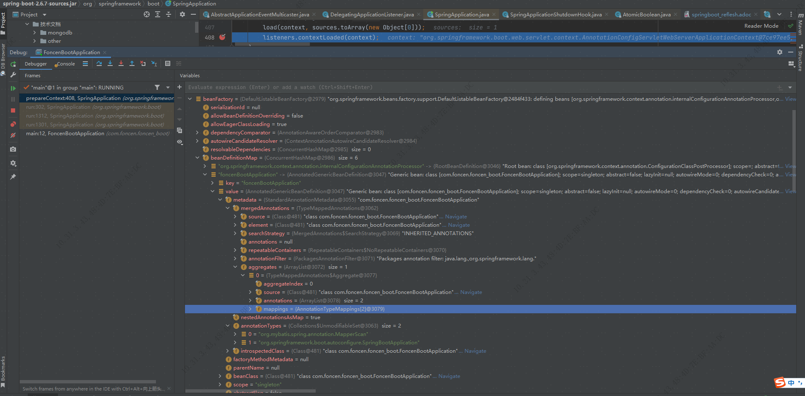
****
===== 1.2.9.1 程序运行关闭钩子
[source,java]
----
private void refreshContext(ConfigurableApplicationContext context) {
		if (this.registerShutdownHook) {
			shutdownHook.registerApplicationContext(context);//关闭钩子添加注册上下文
		}
		refresh(context);//刷新上下文
	}
----
.registerApplicationContext
[source,java]
----
void registerApplicationContext(ConfigurableApplicationContext context) {
		addRuntimeShutdownHookIfNecessary();  //添加关闭钩子
		synchronized (SpringApplicationShutdownHook.class) {
			assertNotInProgress();
			context.addApplicationListener(this.contextCloseListener);
            //上下文添加监听关闭事件的监听器
			this.contexts.add(context);
            // 钩子添加上下文
		}
	}
----
TIP: 看一下钩子添加实现,shutdownHookAdded 标志属性是AtomicBoolean类型的 ,通过cas乐观锁的机制修改变量,可以看到 compareAndSet 的实现,是通过snsafe对象调用compareAndSwapInt(即cas)方法,方法有四个参数,分别为:对象,偏移量,预期的旧值,需要更新的值,在操作期间先比较下在旧值有没有发生变化，如果没有发生变化，交换成新值，发生了变化则不交换。

NOTE: AtomicBoolean 类还定义了一个 long 类型的变量用于存储value(即原子类封装的值)字段的偏移量,获取字段的偏移量也是通过unsafe的objectFieldOffset方法实现的.

.addRuntimeShutdownHookIfNecessary
[source,java]
----
private void addRuntimeShutdownHookIfNecessary() {
		if (this.shutdownHookAdded.compareAndSet(false, true)) {
            //如果cas修改成功,则执行下面的方法
			addRuntimeShutdownHook();
		}
	}
----
.addRuntimeShutdownHook
[source,java]
----

	void addRuntimeShutdownHook() {
		try {
			Runtime.getRuntime().addShutdownHook(new Thread(this, "SpringApplicationShutdownHook"));
            //关闭钩子真正实现是jvm的关闭钩子.
		}
		catch (AccessControlException ex) {
			// Not allowed in some environments
		}
	}
----
NOTE: 当程序正常退出、系统调用 System.exit方法或者程序异常退出，例如使用Ctrl+C触发的中断、用户退出或系统关闭等系统事件等会执行系统中已经设置的所有钩子(钩子线程执行start方法)，当系统执行完这些钩子后，JVM才会关闭。

===== 1.2.9.2 继续刷新
****
刷新的实现是直接调用超类的refresh()方法
[source,java]
----
@Override
	public final void refresh() throws BeansException, IllegalStateException {
		try {
			super.refresh();  //调用超类的刷新
		}
		catch (RuntimeException ex) {
			WebServer webServer = this.webServer;
			if (webServer != null) {
				webServer.stop();
			}
			throw ex;
		}
	}
----
****
===== 1.2.9.3 超类刷新
TIP: 先简单一览

.super.refresh();
[source,java]
----
@Override
	public void refresh() throws BeansException, IllegalStateException {
		synchronized (this.startupShutdownMonitor) {
			StartupStep contextRefresh = this.applicationStartup.start("spring.context.refresh");

			// Prepare this context for refreshing.
            //这一步主要是准备刷新,这里没有执行什么有意义的操作
			prepareRefresh();

			// Tell the subclass to refresh the internal bean factory.
            //这里设置工厂的serializationId 为"application"并返回工厂实例
			ConfigurableListableBeanFactory beanFactory = obtainFreshBeanFactory();

            //以下的将会逐步跟进

			// Prepare the bean factory for use in this context.
			prepareBeanFactory(beanFactory);

			try {
				// Allows post-processing of the bean factory in context subclasses.
				postProcessBeanFactory(beanFactory);

				StartupStep beanPostProcess = this.applicationStartup.start("spring.context.beans.post-process");
				// Invoke factory processors registered as beans in the context.
				invokeBeanFactoryPostProcessors(beanFactory);

				// Register bean processors that intercept bean creation.
				registerBeanPostProcessors(beanFactory);
				beanPostProcess.end();

				// Initialize message source for this context.
				initMessageSource();

				// Initialize event multicaster for this context.
				initApplicationEventMulticaster();

				// Initialize other special beans in specific context subclasses.
				onRefresh();

				// Check for listener beans and register them.
				registerListeners();

				// Instantiate all remaining (non-lazy-init) singletons.
				finishBeanFactoryInitialization(beanFactory);

				// Last step: publish corresponding event.
				finishRefresh();
			}

			catch (BeansException ex) {
				if (logger.isWarnEnabled()) {
					logger.warn("Exception encountered during context initialization - " +
							"cancelling refresh attempt: " + ex);
				}

				// Destroy already created singletons to avoid dangling resources.
				destroyBeans();

				// Reset 'active' flag.
				cancelRefresh(ex);

				// Propagate exception to caller.
				throw ex;
			}

			finally {
				// Reset common introspection caches in Spring's core, since we
				// might not ever need metadata for singleton beans anymore...
				resetCommonCaches();
				contextRefresh.end();
			}
		}
	}
----

====== 1.2.9.3.1 工厂准备
.prepareBeanFactory
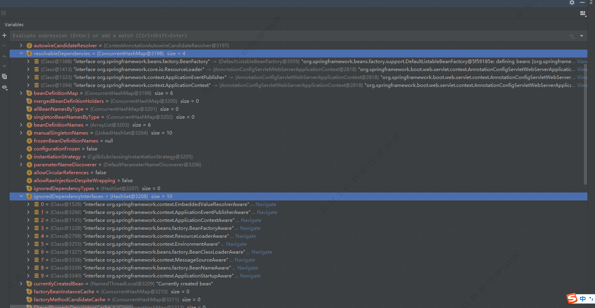

TIP: 这一步主要是添加忽略set注入的接口,如beanFactory.ignoreDependencyInterface(ApplicationContextAware.class);
为某些类指定对应的实例,如beanFactory.registerResolvableDependency(BeanFactory.class, beanFactory); 注册一些bean实例,如属性编辑器,以及添加BeanPostProcessor(bean后处理器,后续会调用)

====== 1.2.9.3.2 beanFactory 后处理
[source,java]
----
	/**
	 * Register ServletContextAwareProcessor.
	 * @see ServletContextAwareProcessor
	 */
	@Override
	protected void postProcessBeanFactory(ConfigurableListableBeanFactory beanFactory) {
		beanFactory.addBeanPostProcessor(new WebApplicationContextServletContextAwareProcessor(this));
        //注册servletContextAwarePressor

		beanFactory.ignoreDependencyInterface(ServletContextAware.class);
        //忽略ServletContextAware的set注入
		registerWebApplicationScopes();
        //注册web应用的域和配置对应的实例,如下图
	}
----
.registerWebApplicationScopes
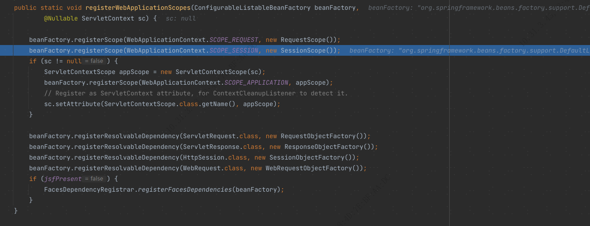

NOTE: 这里有两个域,session和request域,另外spring的bean作用域一览如下

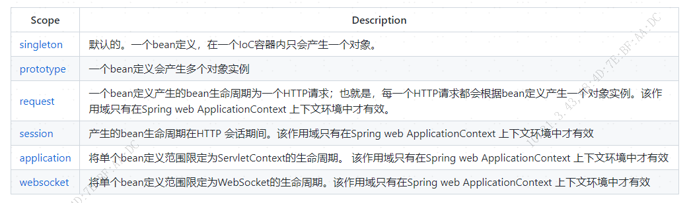

====== 1.2.9.3.3 调用 BeanFactoryPostProcessors
TIP: 主要把上下文中的工厂处理器实例bean注册到 spring 工厂,然后筛选出被 Configuration 注解标识的类,开始加载 BeanDefinition.

.invokeBeanFactoryPostProcessors
[%collapsible]
====
[source,java]
----
public static void invokeBeanFactoryPostProcessors(
			ConfigurableListableBeanFactory beanFactory, List<BeanFactoryPostProcessor> beanFactoryPostProcessors) {

		Set<String> processedBeans = new HashSet<>();
		if (beanFactory instanceof BeanDefinitionRegistry) {
			BeanDefinitionRegistry registry = (BeanDefinitionRegistry) beanFactory;
			List<BeanFactoryPostProcessor> regularPostProcessors = new ArrayList<>();
			List<BeanDefinitionRegistryPostProcessor> registryProcessors = new ArrayList<>();

            //这里遍历了 beanFactoryPostProcessors 调用postProcessBeanDefinitionRegistry方法,
有两个处理器,SharedMetadataReaderFactoryContextInitializer 作用是加载并创建
org.springframework.boot.autoconfigure.internalCachingMetadataReaderFactory  的bean定义,这是一个自动配置bean定义处理
另外一个处理器 ConfigurationWarningsApplicationContextInitializer  主要是检查处理
			for (BeanFactoryPostProcessor postProcessor : beanFactoryPostProcessors) {
				if (postProcessor instanceof BeanDefinitionRegistryPostProcessor) {
					BeanDefinitionRegistryPostProcessor registryProcessor =
							(BeanDefinitionRegistryPostProcessor) postProcessor;
					registryProcessor.postProcessBeanDefinitionRegistry(registry);
					registryProcessors.add(registryProcessor);
				}
				else {
					regularPostProcessors.add(postProcessor);
				}
			}

			// Do not initialize FactoryBeans here: We need to leave all regular beans
			// uninitialized to let the bean factory post-processors apply to them!
			// Separate between BeanDefinitionRegistryPostProcessors that implement
			// PriorityOrdered, Ordered, and the rest.
			List<BeanDefinitionRegistryPostProcessor> currentRegistryProcessors = new ArrayList<>();

			// First, invoke the BeanDefinitionRegistryPostProcessors that implement PriorityOrdered.

// 通过 BeanDefinitionRegistryPostProcessor 类型获取对应实现类的名称,也就是上面提到的  自动配置 bean定义处理器 目前只有一个
			String[] postProcessorNames =
					beanFactory.getBeanNamesForType(BeanDefinitionRegistryPostProcessor.class, true, false);

            //通过 bean的名称获取对应的处理器 实例 ,著名的  getbean 方法超级复杂和冗长,它的作用就是获取实例,后面再详说.
			for (String ppName : postProcessorNames) {
				if (beanFactory.isTypeMatch(ppName, PriorityOrdered.class)) {
					currentRegistryProcessors.add(beanFactory.getBean(ppName, BeanDefinitionRegistryPostProcessor.class));
					processedBeans.add(ppName);
				}
			}
			sortPostProcessors(currentRegistryProcessors, beanFactory);
			registryProcessors.addAll(currentRegistryProcessors);
            // 调用处理加载 bean定义
			invokeBeanDefinitionRegistryPostProcessors(currentRegistryProcessors, registry, beanFactory.getApplicationStartup());
			currentRegistryProcessors.clear();

			// Next, invoke the BeanDefinitionRegistryPostProcessors that implement Ordered.
			postProcessorNames = beanFactory.getBeanNamesForType(BeanDefinitionRegistryPostProcessor.class, true, false);
			for (String ppName : postProcessorNames) {
				if (!processedBeans.contains(ppName) && beanFactory.isTypeMatch(ppName, Ordered.class)) {
					currentRegistryProcessors.add(beanFactory.getBean(ppName, BeanDefinitionRegistryPostProcessor.class));
					processedBeans.add(ppName);
				}
			}
			sortPostProcessors(currentRegistryProcessors, beanFactory);
			registryProcessors.addAll(currentRegistryProcessors);
			invokeBeanDefinitionRegistryPostProcessors(currentRegistryProcessors, registry, beanFactory.getApplicationStartup());
			currentRegistryProcessors.clear();

			// Finally, invoke all other BeanDefinitionRegistryPostProcessors until no further ones appear.
			boolean reiterate = true;
			while (reiterate) {
				reiterate = false;
				postProcessorNames = beanFactory.getBeanNamesForType(BeanDefinitionRegistryPostProcessor.class, true, false);
				for (String ppName : postProcessorNames) {
					if (!processedBeans.contains(ppName)) {
						currentRegistryProcessors.add(beanFactory.getBean(ppName, BeanDefinitionRegistryPostProcessor.class));
						processedBeans.add(ppName);
						reiterate = true;
					}
				}
				sortPostProcessors(currentRegistryProcessors, beanFactory);
				registryProcessors.addAll(currentRegistryProcessors);
				invokeBeanDefinitionRegistryPostProcessors(currentRegistryProcessors, registry, beanFactory.getApplicationStartup());
				currentRegistryProcessors.clear();
			}

			// Now, invoke the postProcessBeanFactory callback of all processors handled so far.
			invokeBeanFactoryPostProcessors(registryProcessors, beanFactory);
			invokeBeanFactoryPostProcessors(regularPostProcessors, beanFactory);
		}

		else {
			// Invoke factory processors registered with the context instance.
			invokeBeanFactoryPostProcessors(beanFactoryPostProcessors, beanFactory);
		}

		// Do not initialize FactoryBeans here: We need to leave all regular beans
		// uninitialized to let the bean factory post-processors apply to them!
		String[] postProcessorNames =
				beanFactory.getBeanNamesForType(BeanFactoryPostProcessor.class, true, false);

		// Separate between BeanFactoryPostProcessors that implement PriorityOrdered,
		// Ordered, and the rest.
		List<BeanFactoryPostProcessor> priorityOrderedPostProcessors = new ArrayList<>();
		List<String> orderedPostProcessorNames = new ArrayList<>();
		List<String> nonOrderedPostProcessorNames = new ArrayList<>();
		for (String ppName : postProcessorNames) {
			if (processedBeans.contains(ppName)) {
				// skip - already processed in first phase above
			}
			else if (beanFactory.isTypeMatch(ppName, PriorityOrdered.class)) {
				priorityOrderedPostProcessors.add(beanFactory.getBean(ppName, BeanFactoryPostProcessor.class));
			}
			else if (beanFactory.isTypeMatch(ppName, Ordered.class)) {
				orderedPostProcessorNames.add(ppName);
			}
			else {
				nonOrderedPostProcessorNames.add(ppName);
			}
		}

		// First, invoke the BeanFactoryPostProcessors that implement PriorityOrdered.
		sortPostProcessors(priorityOrderedPostProcessors, beanFactory);
		invokeBeanFactoryPostProcessors(priorityOrderedPostProcessors, beanFactory);

		// Next, invoke the BeanFactoryPostProcessors that implement Ordered.
		List<BeanFactoryPostProcessor> orderedPostProcessors = new ArrayList<>(orderedPostProcessorNames.size());
		for (String postProcessorName : orderedPostProcessorNames) {
			orderedPostProcessors.add(beanFactory.getBean(postProcessorName, BeanFactoryPostProcessor.class));
		}
		sortPostProcessors(orderedPostProcessors, beanFactory);
		invokeBeanFactoryPostProcessors(orderedPostProcessors, beanFactory);

		// Finally, invoke all other BeanFactoryPostProcessors.
		List<BeanFactoryPostProcessor> nonOrderedPostProcessors = new ArrayList<>(nonOrderedPostProcessorNames.size());
		for (String postProcessorName : nonOrderedPostProcessorNames) {
			nonOrderedPostProcessors.add(beanFactory.getBean(postProcessorName, BeanFactoryPostProcessor.class));
		}
		invokeBeanFactoryPostProcessors(nonOrderedPostProcessors, beanFactory);

		// Clear cached merged bean definitions since the post-processors might have
		// modified the original metadata, e.g. replacing placeholders in values...
		beanFactory.clearMetadataCache();
	}
----
====
TIP: invokeBeanFactoryPostProcessors 方法中主要有两个高频方法,invokeBeanDefinitionRegistryPostProcessors,invokeBeanFactoryPostProcessors;作用是在bean实例化前封装所有自动配置相关的类的bean定义

.看 invokeBeanDefinitionRegistryPostProcessors
====
.invokeBeanDefinitionRegistryPostProcessors
[source,java]
----
private static void invokeBeanDefinitionRegistryPostProcessors(
			Collection<? extends BeanDefinitionRegistryPostProcessor> postProcessors, BeanDefinitionRegistry registry, ApplicationStartup applicationStartup) {

    //遍历处理器,这里只有一个自动配置处理器
		for (BeanDefinitionRegistryPostProcessor postProcessor : postProcessors) {
			StartupStep postProcessBeanDefRegistry = applicationStartup.start("spring.context.beandef-registry.post-process")
					.tag("postProcessor", postProcessor::toString);
            //调用处理方法
			postProcessor.postProcessBeanDefinitionRegistry(registry);
			postProcessBeanDefRegistry.end();
		}
	}
----
====

TIP: 跳过中间校验,直接来到方法的核心

.processConfigBeanDefinitions
[%collapsible]
====
[source,java]
----
	/**
	 * Build and validate a configuration model based on the registry of
	 * {@link Configuration} classes.
	 */
	public void processConfigBeanDefinitions(BeanDefinitionRegistry registry) {
		List<BeanDefinitionHolder> configCandidates = new ArrayList<>();
		String[] candidateNames = registry.getBeanDefinitionNames();

		for (String beanName : candidateNames) {
			BeanDefinition beanDef = registry.getBeanDefinition(beanName);
			if (beanDef.getAttribute(ConfigurationClassUtils.CONFIGURATION_CLASS_ATTRIBUTE) != null) {
				if (logger.isDebugEnabled()) {
					logger.debug("Bean definition has already been processed as a configuration class: " + beanDef);
				}
			}
            //这里是筛选出被 Configuration 注解标识的类,当前只有一个,即项目入口的启动类
			else if (ConfigurationClassUtils.checkConfigurationClassCandidate(beanDef, this.metadataReaderFactory)) {
				configCandidates.add(new BeanDefinitionHolder(beanDef, beanName));
			}
		}

		// Return immediately if no @Configuration classes were found
		if (configCandidates.isEmpty()) {
			return;
		}

		// Sort by previously determined @Order value, if applicable
		configCandidates.sort((bd1, bd2) -> {
			int i1 = ConfigurationClassUtils.getOrder(bd1.getBeanDefinition());
			int i2 = ConfigurationClassUtils.getOrder(bd2.getBeanDefinition());
			return Integer.compare(i1, i2);
		});

		// Detect any custom bean name generation strategy supplied through the enclosing application context
		SingletonBeanRegistry sbr = null;
        //这里获取bean名字生成器单例实例
		if (registry instanceof SingletonBeanRegistry) {
			sbr = (SingletonBeanRegistry) registry;
			if (!this.localBeanNameGeneratorSet) {
				BeanNameGenerator generator = (BeanNameGenerator) sbr.getSingleton(
						AnnotationConfigUtils.CONFIGURATION_BEAN_NAME_GENERATOR);
				if (generator != null) {
					this.componentScanBeanNameGenerator = generator;
					this.importBeanNameGenerator = generator;
				}
			}
		}

		if (this.environment == null) {
			this.environment = new StandardEnvironment();
		}

		// Parse each @Configuration class

        // 创建 Configuration 解析器,解析并封装所有Configuration标志的bean的定义
		ConfigurationClassParser parser = new ConfigurationClassParser(
				this.metadataReaderFactory, this.problemReporter, this.environment,
				this.resourceLoader, this.componentScanBeanNameGenerator, registry);

		Set<BeanDefinitionHolder> candidates = new LinkedHashSet<>(configCandidates);
		Set<ConfigurationClass> alreadyParsed = new HashSet<>(configCandidates.size());
		do {
			StartupStep processConfig = this.applicationStartup.start("spring.context.config-classes.parse");
			parser.parse(candidates);
			parser.validate();

			Set<ConfigurationClass> configClasses = new LinkedHashSet<>(parser.getConfigurationClasses());
			configClasses.removeAll(alreadyParsed);

			// Read the model and create bean definitions based on its content
			if (this.reader == null) {
				this.reader = new ConfigurationClassBeanDefinitionReader(
						registry, this.sourceExtractor, this.resourceLoader, this.environment,
						this.importBeanNameGenerator, parser.getImportRegistry());
			}
			this.reader.loadBeanDefinitions(configClasses);
			alreadyParsed.addAll(configClasses);
			processConfig.tag("classCount", () -> String.valueOf(configClasses.size())).end();

			candidates.clear();
			if (registry.getBeanDefinitionCount() > candidateNames.length) {
				String[] newCandidateNames = registry.getBeanDefinitionNames();
				Set<String> oldCandidateNames = new HashSet<>(Arrays.asList(candidateNames));
				Set<String> alreadyParsedClasses = new HashSet<>();
				for (ConfigurationClass configurationClass : alreadyParsed) {
					alreadyParsedClasses.add(configurationClass.getMetadata().getClassName());
				}
				for (String candidateName : newCandidateNames) {
					if (!oldCandidateNames.contains(candidateName)) {
						BeanDefinition bd = registry.getBeanDefinition(candidateName);
						if (ConfigurationClassUtils.checkConfigurationClassCandidate(bd, this.metadataReaderFactory) &&
								!alreadyParsedClasses.contains(bd.getBeanClassName())) {
							candidates.add(new BeanDefinitionHolder(bd, candidateName));
						}
					}
				}
				candidateNames = newCandidateNames;
			}
		}
		while (!candidates.isEmpty());

		// Register the ImportRegistry as a bean in order to support ImportAware @Configuration classes
		if (sbr != null && !sbr.containsSingleton(IMPORT_REGISTRY_BEAN_NAME)) {
			sbr.registerSingleton(IMPORT_REGISTRY_BEAN_NAME, parser.getImportRegistry());
		}

		if (this.metadataReaderFactory instanceof CachingMetadataReaderFactory) {
			// Clear cache in externally provided MetadataReaderFactory; this is a no-op
			// for a shared cache since it'll be cleared by the ApplicationContext.
			((CachingMetadataReaderFactory) this.metadataReaderFactory).clearCache();
		}
	}
----
====

====
TIP: 筛选配置类
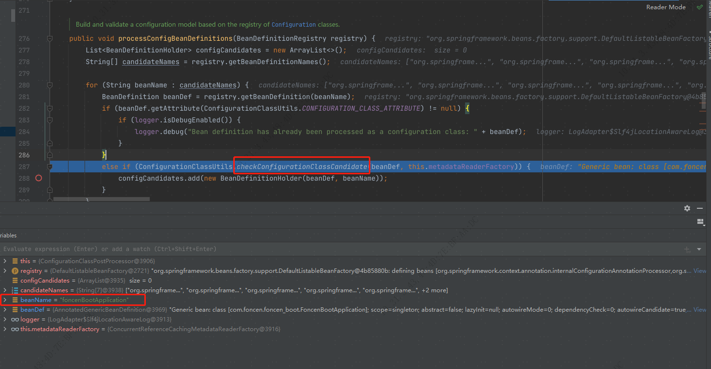
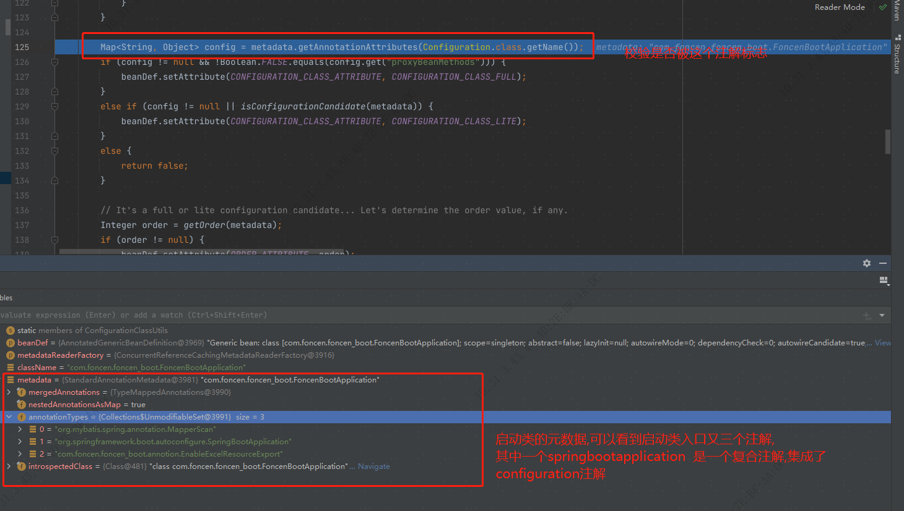

TIP: 创建配置解析器后接着就是解析刚才筛选出来的配置类
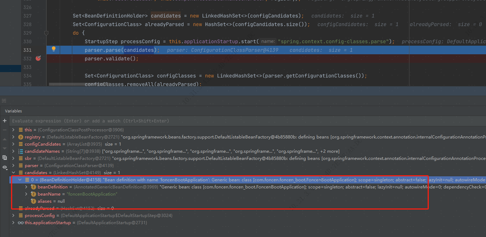

TIP: 直接来到解析方法核心
[source,java]
----
protected void processConfigurationClass(ConfigurationClass configClass, Predicate<String> filter) throws IOException {

    //这里校验是否需要跳过,Conditional注解有一个Condition接口,通过接口的matches方法判断是否需要跳过
		if (this.conditionEvaluator.shouldSkip(configClass.getMetadata(), ConfigurationPhase.PARSE_CONFIGURATION)) {
			return;
		}

		ConfigurationClass existingClass = this.configurationClasses.get(configClass);
		if (existingClass != null) {
			if (configClass.isImported()) {
				if (existingClass.isImported()) {
					existingClass.mergeImportedBy(configClass);
				}
				// Otherwise ignore new imported config class; existing non-imported class overrides it.
				return;
			}
			else {
				// Explicit bean definition found, probably replacing an import.
				// Let's remove the old one and go with the new one.
				this.configurationClasses.remove(configClass);
				this.knownSuperclasses.values().removeIf(configClass::equals);
			}
		}

		// Recursively process the configuration class and its superclass hierarchy.
		SourceClass sourceClass = asSourceClass(configClass, filter);
		do {
            //真正的处理配置类
			sourceClass = doProcessConfigurationClass(configClass, sourceClass, filter);
		}
		while (sourceClass != null);

		this.configurationClasses.put(configClass, configClass);
	}
----
TIP: Conditional注解是否跳过判断
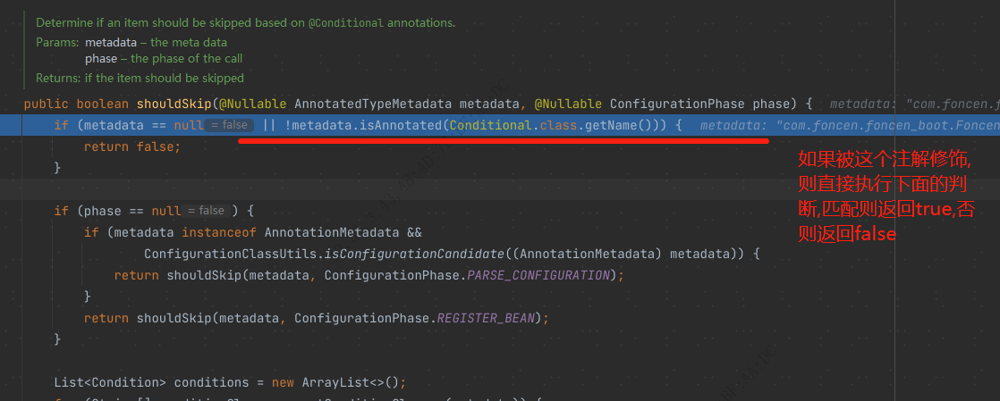

TIP: doProcessConfigurationClass 处理配置类

====
.doProcessConfigurationClass
[%collapsible]
====
[source,java]
----
@Nullable
	protected final SourceClass doProcessConfigurationClass(
			ConfigurationClass configClass, SourceClass sourceClass, Predicate<String> filter)
			throws IOException {

    // 判断源类是否被 Component 修饰
		if (configClass.getMetadata().isAnnotated(Component.class.getName())) {
			// Recursively process any member (nested) classes first
            //处理内部类,如果存在内部类,并且被Component,ComponentScan,Import,ImportResource 这四个注解修饰则会添加加成员类数组里边,并且再次调用本方法处理
			processMemberClasses(configClass, sourceClass, filter);
		}

		// Process any @PropertySource annotations

处理被 PropertySource 修饰的源类
		for (AnnotationAttributes propertySource : AnnotationConfigUtils.attributesForRepeatable(
				sourceClass.getMetadata(), PropertySources.class,
				org.springframework.context.annotation.PropertySource.class)) {
			if (this.environment instanceof ConfigurableEnvironment) {
				processPropertySource(propertySource);
			}
			else {
				logger.info("Ignoring @PropertySource annotation on [" + sourceClass.getMetadata().getClassName() +
						"]. Reason: Environment must implement ConfigurableEnvironment");
			}
		}

		// Process any @ComponentScan annotations
//查找包扫描注解,把每个扫描注解的属性封装到set里边
		Set<AnnotationAttributes> componentScans = AnnotationConfigUtils.attributesForRepeatable(
				sourceClass.getMetadata(), ComponentScans.class, ComponentScan.class);
		if (!componentScans.isEmpty() &&
				!this.conditionEvaluator.shouldSkip(sourceClass.getMetadata(), ConfigurationPhase.REGISTER_BEAN)) {
            //遍历处理扫描注解
			for (AnnotationAttributes componentScan : componentScans) {
				// The config class is annotated with @ComponentScan -> perform the scan immediately
//解析处理扫描路径下的类
				Set<BeanDefinitionHolder> scannedBeanDefinitions =
						this.componentScanParser.parse(componentScan, sourceClass.getMetadata().getClassName());
				// Check the set of scanned definitions for any further config classes and parse recursively if needed
				for (BeanDefinitionHolder holder : scannedBeanDefinitions) {
					BeanDefinition bdCand = holder.getBeanDefinition().getOriginatingBeanDefinition();
					if (bdCand == null) {
						bdCand = holder.getBeanDefinition();
					}
					if (ConfigurationClassUtils.checkConfigurationClassCandidate(bdCand, this.metadataReaderFactory)) {
                        //从扫描路径出来的bean定义数组中再次遍历处理
						parse(bdCand.getBeanClassName(), holder.getBeanName());
					}
				}
			}
		}

		// Process any @Import annotations
//处理Import导入
		processImports(configClass, sourceClass, getImports(sourceClass), filter, true);

		// Process any @ImportResource annotations
		AnnotationAttributes importResource =
				AnnotationConfigUtils.attributesFor(sourceClass.getMetadata(), ImportResource.class);
		if (importResource != null) {
			String[] resources = importResource.getStringArray("locations");
			Class<? extends BeanDefinitionReader> readerClass = importResource.getClass("reader");
			for (String resource : resources) {
				String resolvedResource = this.environment.resolveRequiredPlaceholders(resource);
				configClass.addImportedResource(resolvedResource, readerClass);
			}
		}

		// Process individual @Bean methods
		Set<MethodMetadata> beanMethods = retrieveBeanMethodMetadata(sourceClass);
		for (MethodMetadata methodMetadata : beanMethods) {
			configClass.addBeanMethod(new BeanMethod(methodMetadata, configClass));
		}

		// Process default methods on interfaces
		processInterfaces(configClass, sourceClass);

		// Process superclass, if any
		if (sourceClass.getMetadata().hasSuperClass()) {
			String superclass = sourceClass.getMetadata().getSuperClassName();
			if (superclass != null && !superclass.startsWith("java") &&
					!this.knownSuperclasses.containsKey(superclass)) {
				this.knownSuperclasses.put(superclass, configClass);
				// Superclass found, return its annotation metadata and recurse
				return sourceClass.getSuperClass();
			}
		}

		// No superclass -> processing is complete
		return null;
	}
----
====
TIP: 可以看到启动类的注解树被拍平并且去重,其中就有一个component注解
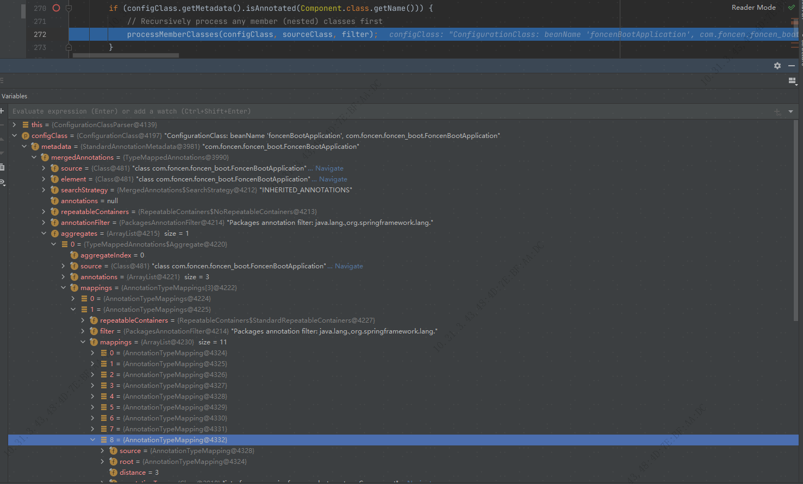#

TIP: 扫描路径如果没有指定会添加当前启动类的同级路径作为扫描路径,扫描匹配类型为 /**/*.class 文件
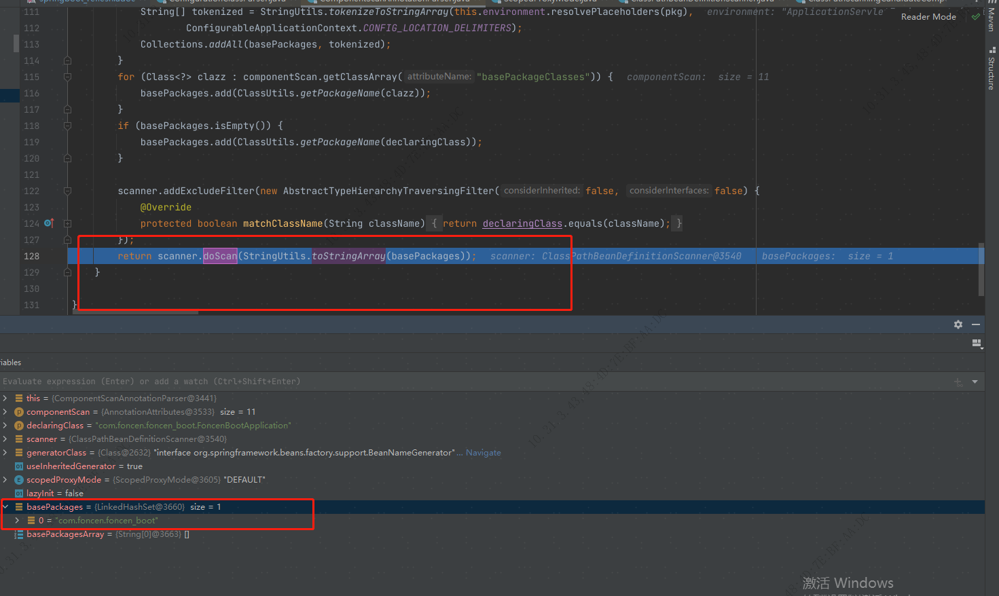

.doScan
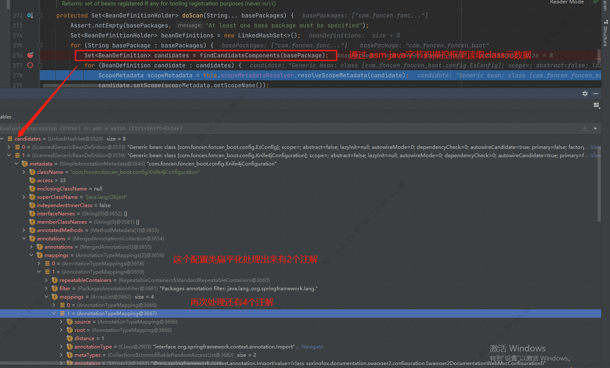

.bean定义属性处理
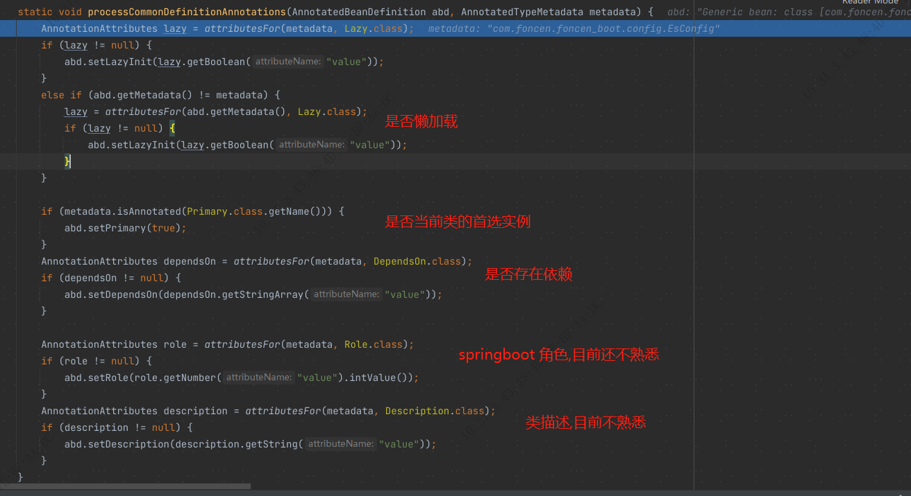

