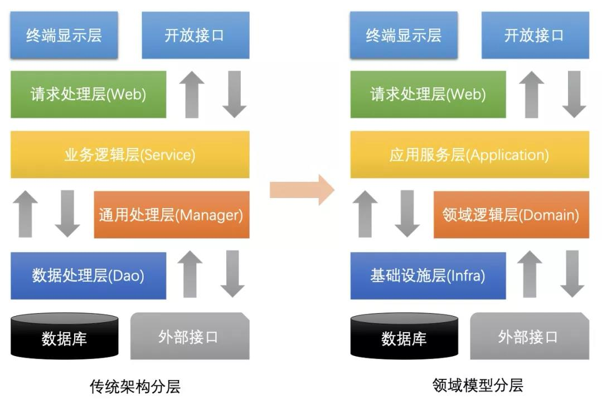
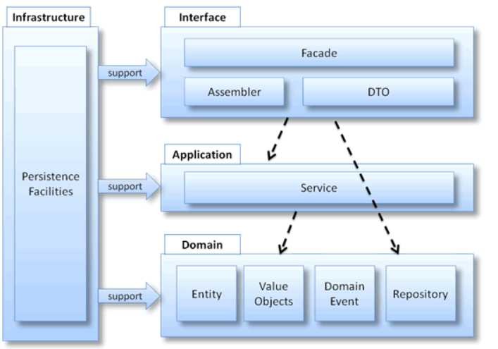

> #### 商城系统

为了提高储备团队开发技能，我们来做一个商城系统，天猫、淘宝、京东业务过于复杂，所以我们模仿网易严选，地址：http://you.163.com/

> #### 微服务框架
微服务基础框架采用SpringCloud Alibaba
```
Nacos 作为注册中心，配置中心
Sentinel 作为熔断、限流
Feign 作为微服务调用
Elasticsearch 作为商品搜索框架
Mongodb 作为商品详情、评论、点赞
RocketMQ 作为短信发送、邮箱发送、Es同步
Minio 作为文件存储器
Redis 作为登录信息缓存、其他热点数据缓存
Reddssion 作为分布式锁、防重复提交
Seata 作为分布式事务框架、订单和支付的之间事务
EFK 作为调用链日志分析框架（logback）
SpringCloudGateway 作为微服务网关
MybatisPlus 作为数据访问框架
XXL-JOB 作为任务调度平台
```

> #### 微服务划分
```
mall-api 接口服务
mall-auth 统一登录鉴权服务
mall-base 公用组件工程
mall-ums 后台管理服务
mall-fms 前端管理服务
mall-gms 商品管理服务
mall-oms 订单管理服务
mall-flash 秒杀服务
mall-pay 支付服务
mall-scg 网关服务
mall-search 搜索服务
mall-minio 文件存储服务
```

> #### 领域驱动设计
所有的微服务，设计遵循DDD领域驱动设计，对比传统架构和DDD架构区别
```
传统架构                                            
所有业务都在service，不方便阅读。
复杂业务不方便单元测试，需要写很多挡板。
在业务越来越复杂并且快速迭代项目开发成本迅速增加。

DDD架构
业务流程在application层，业务操作范围在domain层，方便阅读。
每层都可以单独写测试案例，单元测试变得简单。
复杂业务有领域划分，服务编排实现实现功能，降低开发成本。
```

<p>

工程结构分为四层从上到下分别是：interfaces、application、domain、infrastructure。结构图如下:

<p>

> #### 工程机构
**interfaces层**

负责向用户显示信息和开发接口，也就是我们常说的Controller，这层需要做JSR303参数校验，
只有当参数校验都通过之后才调用application层

**application层**

应用层定义了软件要完成的任务,要尽量简单，为Domain层协助任务、委托工作、调用其他服务接口、调用领域对象或领域服务完成各种业务逻辑任务

**domain层**

```
主要负责表达业务概念,业务状态信息和业务规则，Domain层主要有
1、实体(Entities): 具有唯一标识的对象，实体可以设计成充血模型。
2、值对象(Value Objects): 无需唯一标识的对象，例如：一对一，一对多业务模型。
3、领域服务(Domain Services): 一些行为无法归类到实体对象或值对象上，本质是一些操作，而非事物。
4、仓储(Repository): 一些持久化接口，具体数据库操作在infrastructure层
```

**infrastructure层**

基础实施层，向其他层提供通用的技术能力(比如工具类，常用基本配置，数据访问底层实现，第三方库类支持)


